# Localidade e amostragem de cargas de cache — v2

*Data:* 30 de setembro de 2026
*Dados:* cargas sintéticas da fase `f03` (`geracao/fases/f03-experimento/`, 3 × 1 milhão de
requisições) e suas amostras na fase `a01` (`amostragem/fases/a01-temporal-f03/`, 27 amostras)
*Código de análise:* `lib/medidas.py` (instrumento de medida), `geracao/pipeline.py`,
`amostragem/pipeline.py`, `amostragem/graficos.py`; técnicas de amostragem em
`cache-sampling/sampling/` (usadas sem modificação)
*Documentos relacionados:* [`METODOLOGIA.md`](METODOLOGIA.md) (o instrumento: como as cargas são
geradas e por que são confiáveis), [`geracao/README.md`](geracao/README.md),
[`amostragem/README.md`](amostragem/README.md)
*Versão anterior:* v1, com hipóteses e amostragem espacial (SHARDS); substituída por esta.

---

## Contexto

Um cache guarda itens para que pedidos repetidos sejam atendidos sem ir à origem. Quanto ele
acerta depende de quanto a carga **reusa** o que já pediu, e de quão perto no tempo esses reúsos
acontecem. A medida clássica dessa proximidade é a **stack distance** (SD): o número de objetos
distintos requisitados entre dois pedidos ao mesmo objeto. Num cache LRU de C objetos, um reúso
acerta exatamente quando a sua SD é menor que C, e por isso a distribuição de SD determina a curva
de hit rate inteira:

```
hit(C) = (1 − P(∞)) · P(d < C)
```

Avaliar um cache sobre um trace real completo é caro: os traces de produção têm de centenas de
milhões a bilhões de requisições. Uma saída comum é simular sobre uma **amostra** do trace — uma
fração das requisições — e usar o resultado como estimativa do comportamento do trace inteiro. O
`cache-sampling` faz isso com duas técnicas temporais, a **sistemática** e a **por janela**, sobre
traces do X (antigo Twitter).

Em traces reais, porém, a localidade é uma característica herdada do dado: ninguém a controla.
Quando uma amostra erra, não há como separar o quanto do erro vem da técnica e o quanto vem da
localidade daquela carga específica. Aqui a localidade é **manipulada**: as cargas são sintéticas,
com a distribuição de SD definida por um parâmetro, e a curva de hit rate de um cache LRU é
conhecida analiticamente antes de qualquer simulação. Isso permite aplicar as mesmas técnicas de
amostragem a cargas de localidade conhecida e observar como cada uma responde a ela.

**O que este experimento não é.** Não é uma afirmação sobre tráfego real. As cargas são
estacionárias, os objetos têm todos o mesmo tamanho e a popularidade é uma consequência, não um
parâmetro. Os resultados descrevem o mecanismo — como cache e amostragem respondem ao nível de
stack distance —, não o comportamento de uma CDN ou de um servidor específico.

## Objetivo

1. Como o nível de stack distance de uma carga afeta a curva de hit rate de um cache?
2. Para cada técnica e taxa de amostragem, quanto a amostra reproduz a carga original — na curva
   de hit rate, na distribuição de stack distance, no footprint e na frequência por objeto — e
   como isso muda com o nível de stack distance da carga?
3. *(Parte 2, a detalhar.)* Como o nível de stack distance afeta o desempenho relativo das
   políticas de despejo?

---

## Desenho do experimento

O laboratório tem três partes, que consomem as **mesmas três cargas**:

```
Parte 1 — geração        Parte 3 — amostragem                        Parte 2 — simulação
3 cargas, uma por   →    9 amostras por carga (técnica × taxa),  →   políticas de despejo
nível de SD              medidas contra a carga original             sobre as cargas (a detalhar)
geracao/                 amostragem/                                 simulacao/
```

### As cargas

Cada carga é gerada pelo **LRU Stack Model** (Mattson et al., 1970; Turner e Strecker, 1977): a
cada requisição, sorteia-se uma profundidade *d* de uma distribuição-alvo e requisita-se o objeto
que está nessa profundidade da pilha LRU; com probabilidade P(∞), requisita-se um objeto novo. A
distribuição-alvo é uma lei de potência, P(d) ∝ (d+1)^−β, e **só o β muda entre as cargas**.

| Carga | β | SD mediana | SD p90 | Footprint em 1.000 req | Objetos distintos |
|---|---|---|---|---|---|
| `baixa-b150` — SD baixa | 1,5 | 1 | 51 | 140 | 50.489 |
| `media-b100` — SD média | 1,0 | 74 | 3.769 | 435 | 54.852 |
| `alta-b050` — SD alta | 0,5 | 2.536 | 8.119 | 819 | 57.264 |

*Medido na fase `f03`, com o aquecimento do gerador. As medianas ficam separadas por cerca de duas
ordens de grandeza entre níveis vizinhos. A curva de hit medida difere da teórica em no máximo
0,0008, contra um limite aceito de 0,0025.*

### As técnicas de amostragem

As duas técnicas são as do `cache-sampling`, com os mesmos scripts, taxas e janelas.

**Sistemática.** Toma uma requisição a cada *k*: a cada 100 para 1%, a cada 10 para 10%, a cada
5 para 20%. A amostra se espalha uniformemente pelo trace, mas cada requisição fica isolada das
vizinhas.

**Por janela.** Divide o trace em janelas de tamanho fixo e toma as últimas *take* requisições de
cada janela, preservando trechos contínuos do trace. Roda com dois valores de *take*:

| Taxa | Janela (take = 1.000) | Janela (take = 10.000) |
|---|---|---|
| 1% | 100.000 | 1.000.000 |
| 10% | 10.000 | 100.000 |
| 20% | 5.000 | 50.000 |

Antes de amostrar, cada carga é convertida para o formato que o `cache-sampling` espera
(`timestamp,id,tamanho`, sem cabeçalho). O timestamp vira a posição da requisição na carga e o
tamanho é 1; com TTL infinito e cache contado em objetos, nenhum dos dois altera o resultado.

### O instrumento de medida

Todas as métricas saem de `lib/medidas.py`, o mesmo módulo que confere as cargas na geração, e
são aplicadas **com a mesma régua** à carga original e a cada amostra. A curva de hit rate LRU é
calculada a partir das stack distances (algoritmo de Mattson): uma única passada pelo trace dá o
hit rate exato de **todos** os tamanhos de cache ao mesmo tempo, sem uma simulação por tamanho.

O resultado foi conferido contra o simulador do `cache-sampling` (`cache-simulator`, em Go),
rodado sobre os mesmos arquivos: os dois dão o mesmo hit rate até a quarta casa — por exemplo,
0,1293 para a amostra sistemática de 10% da carga de SD média, com cache de 100 objetos.

### Aquecimento

O gerador emite, antes da carga, um **prefixo de aquecimento** de `d_max` = 10.000 linhas, que
deixa um cache LRU no mesmo estado da pilha inicial do gerador. Esse prefixo é um artefato do
gerador, não parte da carga, e é **descartado antes da amostragem**.

Assim, a carga original e as amostras são medidas do mesmo jeito que o simulador as veria:
começando com o cache vazio, sem descartar nada. É a mesma referência que o `cache-sampling` usa
(o trace completo simulado do zero). A diferença para a carga aquecida é pequena — a SD mediana da
carga média fica em 72, contra 74 com aquecimento —, e a curva teórica é reportada ao lado como
terceira referência.

### Cenários

Cada cenário é uma combinação de **carga** com **forma de observá-la**: a carga original inteira
ou uma das nove amostras. São 3 cargas × (1 original + 9 amostras) = **30 traces**, cada um medido
em toda a grade de tamanhos de cache.

| Técnica (nome no arquivo) | Método | Taxa | Janela | Take | Linhas | Trechos contínuos |
|---|---|---|---|---|---|---|
| `completa` | — (referência) | 100% | — | — | 1.000.000 | 1 |
| `sis-p01` | sistemática | 1% | — | — | 10.001 | 10.001 |
| `sis-p10` | sistemática | 10% | — | — | 100.001 | 100.001 |
| `sis-p20` | sistemática | 20% | — | — | 200.001 | 200.001 |
| `jan-p01-t1k` | janela | 1% | 100.000 | 1.000 | 10.000 | 10 |
| `jan-p10-t1k` | janela | 10% | 10.000 | 1.000 | 100.000 | 100 |
| `jan-p20-t1k` | janela | 20% | 5.000 | 1.000 | 200.000 | 200 |
| `jan-p01-t10k` | janela | 1% | 1.000.000 | 10.000 | 10.000 | 1 |
| `jan-p10-t10k` | janela | 10% | 100.000 | 10.000 | 100.000 | 10 |
| `jan-p20-t10k` | janela | 20% | 50.000 | 10.000 | 200.000 | 20 |

Os arquivos seguem o padrão `amostra_<fase>_<carga>_<técnica>.csv` — por exemplo,
`amostra_a01_media-b100_jan-p10-t1k.csv` é a amostra por janela de 10%, take 1.000, da carga de SD
média. A sistemática tem uma linha a mais porque o script copia a primeira linha do arquivo antes
de começar a contar (ver `amostragem/README.md`).

---

## Variáveis do experimento

### Variáveis independentes

- **Nível de stack distance da carga:** a velocidade com que a probabilidade de reúso cai
  conforme a distância cresce (β da lei de potência).
  - Valores: baixa (β = 1,5), média (β = 1,0), alta (β = 0,5)
- **Técnica de amostragem:** como as requisições da amostra são escolhidas.
  - Valores: sistemática; por janela
- **Take:** quantas requisições contínuas a amostragem por janela toma de cada janela.
  - Valores: 1.000; 10.000 (só para a técnica por janela)
- **Taxa de amostragem:** fração das requisições da carga que entram na amostra.
  - Valores: 1%, 10%, 20% (e 100%, a carga original, como referência)
- **Tamanho do cache:** número de objetos que o cache comporta. É o eixo das curvas de resposta,
  com o **mesmo tamanho absoluto** na amostra e na carga original.
  - Valores: grade logarítmica entre 1 e 1.000.000 objetos (43 pontos), mais `d_max` e os
    tamanhos de conferência (1, 10, 100, 1.000, 10.000) — 47 tamanhos ao todo
- **Política de despejo:** qual item sai quando o cache está cheio.
  - Valores: LRU nas partes 1 e 3.

### Variáveis controladas - geração da carga

| Variável | Valor |
|---|---|
| Requisições por carga | 1.000.000 |
| Objetos novos, P(∞) | 0,05 do total de requisições |
| Alcance do reúso, `d_max` | 10.000 |
| Família da distribuição de SD | lei de potência, P(d) ∝ (d+1)^−β |
| Tamanho dos itens | todos iguais (1) |
| Semente do gerador | 7 — uma carga por nível |
| Aquecimento do gerador | 10.000 linhas, descartadas antes da amostragem |
| Estado inicial do cache | vazio, na carga original e nas amostras |
| TTL | infinito (nenhum item expira) |
| Controle de admissão | desligado |
| Réplicas de cache | 1 |

### Variáveis dependentes

- **Resultado de cada requisição num cache LRU de C objetos:**
  - "hit" quando o objeto está no cache (reúso com SD < C);
  - "miss" quando não está — seja a primeira vez que o objeto aparece no trace, seja um reúso
    com SD ≥ C.
- **Stack distance de cada requisição:** objetos distintos desde o pedido anterior ao mesmo
  objeto, ou ∞ na primeira aparição.
- **Número de requisições recebidas por cada objeto.**
- **Objetos distintos em cada janela de N requisições consecutivas.**

### Métricas

- **Hit rate:** fração das requisições com resultado "hit", para cada tamanho de cache (a curva de
  hit rate). *Arquivo:* `hrc_<fase>.csv`.
- **Erro de estimativa da curva:** hit rate da amostra menos hit rate da carga original, no mesmo
  tamanho de cache. Resumido por amostra como **erro máximo** (e o tamanho de cache em que ocorre)
  e **erro médio absoluto** ao longo da grade — como a grade é logarítmica, cada década de tamanho
  de cache pesa o mesmo na média. *Arquivos:* `hrc_<fase>.csv`, `medidas_<fase>.csv`.
- **Distribuição de stack distance:** percentis (p25, p50, p75, p90, p99), maior SD, função
  acumulada e histograma em faixas de oitava. *Arquivos:* `medidas_`, `sd_cdf_`,
  `sd_histograma_<fase>.csv`.
- **Footprint:** média de objetos distintos por janela de N requisições, para N de 1 até o trace
  inteiro; em um número, o valor em N = 1.000 e o total de objetos distintos. *Arquivos:*
  `footprint_`, `medidas_<fase>.csv`.
- **Frequência por objeto:** curva rank × requisições, histograma de requisições por objeto,
  média, fração de objetos pedidos uma única vez, fração das requisições que vai para o 1% e para
  os 10% mais pedidos. *Arquivos:* `frequencia_`, `frequencia_hist_`, `medidas_<fase>.csv`.
- **Tamanho efetivo da amostra:** linhas, fração real da carga e número de trechos contínuos.
  *Arquivo:* `amostras_<fase>.csv`.
  
Cada métrica tem um gráfico em facetas (`analise/<métrica>_<fase>.svg`): uma linha por técnica de
amostragem, uma coluna por nível de SD e, em cada faceta, a carga original contra a amostrada, com
os mesmos eixos em toda a figura.

---

## Os valores escolhidos, e por quê

Boa parte destes valores é arbitrária no sentido de que outros valores próximos serviriam. O que
não é arbitrário é a **razão de ordem de grandeza** entre eles: é ela que garante que as diferenças
entre os cenários caibam na faixa medida.

**Um milhão de requisições por carga.** O desvio esperado de uma proporção medida em *n*
requisições é 0,5/√n; com 1 milhão, 0,0005. O aquecimento de 10.000 linhas é 1% da carga. E é
barato: gerar e conferir as três cargas levou 34 segundos, e amostrar e medir as 27 amostras, 35.

**Objetos novos: P(∞) = 0,05.** A fração é sobre o total de requisições: numa carga de 1 milhão,
cerca de 50 mil são a estreia de um objeto. Nos modelos de tráfego real distribuídos com o TRAGEN,
essa fração vai de 4% (downloads) a 42% (mídia social); o valor escolhido fica na ponta baixa, o
regime em que a localidade tem espaço para importar, e deixa o teto do hit rate em 0,95. É igual
nos três níveis, para que a taxa de novidade não se confunda com a localidade.

**`d_max` = 10.000: o alcance do reúso.** É a maior SD que a distribuição pode sortear, e portanto
o tamanho de cache a partir do qual a curva LRU da carga original chega ao teto. Não é o tamanho do
acervo: objetos novos entram o tempo todo, e as cargas terminam com 50 a 57 mil objetos distintos.

**A lei de potência.**

*De que probabilidade se está falando.* O gerador monta a carga uma requisição por vez. Para cada
requisição, ele primeiro decide se ela é um objeto novo ou o reúso de um objeto que já apareceu.
Se for um reúso, ele precisa decidir **qual** objeto antigo pedir, e decide escolhendo uma stack
distance: "peça o objeto que foi usado há *d* objetos distintos atrás". A lei de potência é a regra
que diz com que frequência cada distância é escolhida. Então, toda vez que este texto fala em "a
probabilidade de uma distância", é isto: entre os reúsos da carga, que fração tem aquela distância.

*O que a lei de potência faz com as distâncias.* Ela segue duas regras.

- **Quanto maior a distância, menos ela é escolhida.** Pedir de novo algo que acabou de ser usado
  é o mais comum; pedir algo usado há muito tempo é mais raro. Cada distância é um pouco menos
  provável que a anterior.
- **A queda é proporcional, não absoluta.** A lei de potência não diz "a cada passo, perde-se
  tanto"; diz "quando a distância dobra, a chance cai na mesma proporção". Passar da distância 1
  para a 2 reduz a chance na mesma proporção que passar da 1.000 para a 2.000. Por isso as
  distâncias longas ficam raras, mas **nunca desaparecem**: a chance vai diminuindo devagar, sem
  um ponto a partir do qual ela praticamente zera. É isso que se chama de **cauda longa** — a
  maioria dos reúsos é curta, mas sempre sobra uma parte de reúsos muito longos.

Outras regras de queda não se comportam assim. Numa queda exponencial, por exemplo, cada passo
multiplica a chance pelo mesmo fator; depois de algumas centenas de passos ela já é tão pequena que,
na prática, nenhum reúso longo acontece. A lei de potência foi escolhida justamente por manter os
reúsos longos existindo.

*O que β controla.* β é a **velocidade dessa queda**. Com β alto, a chance cai depressa conforme a
distância cresce; com β baixo, cai devagar, e distâncias longas continuam relativamente comuns.

*Por que três valores de β dão cargas tão diferentes.* Há duas forças puxando em sentidos opostos.
A primeira é a que acabou de ser descrita: cada distância longa, individualmente, é menos provável
que uma curta. A segunda é que **existem muito mais distâncias longas do que curtas**. Entre 1 e 9
há 9 distâncias possíveis; entre 1.000 e 9.999, há 9.000. Mesmo que cada uma dessas 9.000 seja rara,
juntas elas podem somar muito. O que acontece com a carga depende de qual das duas forças vence, e
é β que decide:

- **β alto (SD baixa):** a queda é tão rápida que vence a quantidade. Quase todos os reúsos ficam
  nas distâncias curtas, e as longas, mesmo sendo muitas, somam pouco.
- **β intermediário (SD média):** as duas forças empatam. Cada faixa de distâncias — de 1 a 9, de
  10 a 99, de 100 a 999, e assim por diante — recebe a mesma fatia dos reúsos. Uma consequência
  direta: aumentar o cache de 10 para 100 objetos ganha o mesmo tanto de hit rate que aumentar de
  100 para 1.000, porque cada faixa nova que passa a caber no cache traz a mesma quantidade de
  reúsos. É exatamente esse comportamento — o hit rate crescendo o mesmo tanto a cada vez que o
  cache é multiplicado por dez — que Breslau et al. (1999) observaram em caches web reais.
- **β baixo (SD alta):** a queda é tão lenta que a quantidade vence. Como há muito mais distâncias
  longas, a maior parte dos reúsos fica nelas, perto do limite `d_max`.

O gráfico `sd_histograma` da fase de amostragem mostra essas três formas lado a lado, na linha da
carga original.

*Por que usar a lei de potência.*

1. **Ela reproduz a cauda longa que se vê em cargas reais.** Os estudos de cargas web concordam que
   a maior parte dos reúsos é curta, mas que uma parte não desprezível é muito longa. Uma regra sem
   cauda longa, como a exponencial, produziria cargas em que reúsos longos simplesmente não
   existem, e isso não corresponde ao que se mede.
2. **Um único controle leva de um extremo ao outro.** Mexendo só em β, a carga vai de "quase todo
   reúso é imediato" até "quase todo reúso é distante", passando pelo caso intermediário em que
   todas as faixas de distância pesam igual. Isso permite montar os três níveis do experimento
   mudando uma coisa só.

*A ressalva.* A lei de potência não é a única forma usada para descrever cargas reais. Breslau et
al. (1999) encontram um comportamento compatível com ela; Almeida et al. (1996), que foram os
primeiros a descrever a localidade das cargas web pela stack distance, e o gerador SURGE (Barford e
Crovella, 1998) usam outra forma, a **lognormal**, que também tem cauda longa. Com os dados reais,
é difícil dizer qual das duas se ajusta melhor (Mitzenmacher, 2004; Clauset, Shalizi e Newman,
2009). Por isso a escolha da lei de potência é tratada como uma decisão do experimento, e não como
um fato sobre as cargas reais. Para uma introdução às leis de potência, o texto de referência é
Newman (2005).

A lei de potência tem ainda uma limitação que importa para a interpretação: ao mudar β, a carga
muda em dois aspectos ao mesmo tempo, e não em um só — ver "Nível e espalhamento andam juntos", em
Ameaças à validade.

**Taxas e janelas de amostragem.** São as do `cache-sampling`, sem ajuste, para manter os
resultados comparáveis com o estudo sobre os traces do X. Elas foram dimensionadas para traces de
centenas de milhões de linhas; numa carga de 1 milhão, a janela de 1% com take de 10.000 vira um
único trecho contínuo, e a de 1% com take de 1.000, dez trechos. A coluna de trechos contínuos na
tabela de cenários registra isso para cada amostra.

**Uma carga por nível, uma amostra por técnica, sem réplicas.** Para LRU, a curva de hit rate de
cada carga é conhecida analiticamente, e o desvio de uma carga em relação ao seu valor esperado é
medido contra a teoria a cada rodada: fica entre 0,0006 e 0,0008, cerca de mil vezes menor que as
diferenças entre níveis (com cache de 100 objetos, o hit rate vai de 0,88 no nível baixo a 0,50 no
médio e 0,09 no alto). As duas técnicas de amostragem são **determinísticas**: dada a carga, cada
combinação de técnica e taxa produz sempre a mesma amostra. Não há semente a variar, e portanto não
há réplica a fazer sem mudar a técnica.

---

## O tamanho dos itens

**Todos os objetos têm o mesmo tamanho.** A métrica de interesse é o hit rate por requisição; com
tamanhos iguais, ele é idêntico ao hit rate por byte, e a dimensão do tamanho não acrescenta nada
à resposta. Três consequências: a SD é contada em objetos, e um cache de C objetos é exatamente um
cache de capacidade C; não há admissão por tamanho, fragmentação nem a escolha entre despejar um
objeto grande ou vários pequenos; e o viés de tamanho que obriga geradores de tráfego de CDN a
mecanismos especiais não existe.

A limitação, dita de forma clara: os resultados não se transferem automaticamente para caches de
objetos heterogêneos, em que hit rate por byte e por requisição divergem e políticas cientes de
tamanho (GD-Size, AdaptSize) passam a fazer sentido.

## Resultados

Os resultados vêm em duas partes. A primeira descreve as **cargas completas** — como ficaram as três
cargas geradas e se elas têm a localidade que foi pedida. A segunda compara, métrica por métrica,
**cada amostra com a carga completa de onde ela saiu**. Todos os números estão nos CSVs das pastas
`analise/` das fases `f03` e `a01`, e todos os gráficos são os arquivos SVG gerados pelos pipelines.

### Como ler os gráficos

Algumas escolhas de escala mudam o que os gráficos deixam ver, e vale tê-las em mente antes das
figuras.

- **Eixos em escala logarítmica.** O tamanho do cache, a stack distance, o tamanho da janela e o
  rank do objeto estão em escala log: cada década (de 1 a 10, de 10 a 100, de 100 a 1.000…) ocupa o
  mesmo espaço. Isso deixa ver ao mesmo tempo caches de 1 e de 1 milhão de objetos, mas dá aos
  caches pequenos o mesmo espaço visual que aos grandes, embora sejam muito menos numerosos na
  grade real de tamanhos.
- **A região depois de `d_max` é plana.** Nas curvas de hit e na acumulada da SD da carga completa,
  tudo acima de 10.000 é uma linha reta no teto: nenhum reúso passa de `d_max`. Essa região ocupa
  duas das seis décadas do eixo, então uma boa parte de cada gráfico mostra só o teto de cada curva.
- **Dois eixos log (footprint e frequência) achatam diferenças.** Quando o eixo vertical também é
  logarítmico, uma diferença de duas vezes aparece como um deslocamento pequeno. Curvas que parecem
  quase coladas podem diferir bastante em valor absoluto; as tabelas abaixo dão os números.
- **Valores zero não aparecem em escala log.** Uma faixa de histograma vazia simplesmente não tem
  barra, e o menor valor possível da frequência (um objeto pedido uma única vez) fica encostado no
  piso do gráfico.
- **As faixas dos histogramas têm larguras diferentes.** São oitavas: 1, 2–3, 4–7, 8–15… Cada faixa
  cobre o dobro de valores da anterior, e a altura da barra é a fração de reúsos (ou de objetos) que
  cai nela inteira, não por valor.
- **Eixos iguais em todas as facetas.** Nos gráficos da amostragem, todas as facetas de uma figura
  usam a mesma escala, para que a comparação entre elas seja direta. O preço é que diferenças
  pequenas (abaixo de ~0,01 no hit rate) não se distinguem a olho; o valor do erro está escrito em
  cada faceta da curva de hit e nas tabelas.
- **O erro médio pesa cada década por igual.** Ele é a média do erro absoluto nos 47 tamanhos de
  cache da grade, que é logarítmica. Como a região acima de `d_max` ocupa parte da grade, o erro
  médio inclui a diferença entre os tetos da amostra e da carga completa.

---

### Parte 1 — As cargas completas

**As cargas saíram como foram pedidas.** Para cada carga, a curva de hit rate medida foi comparada
com a curva calculada da distribuição, nos 44 tamanhos de cache da conferência. A maior diferença
foi de 0,0006 (SD baixa), 0,0007 (SD média) e 0,0008 (SD alta), contra um limite aceito de 0,0025 —
a variação esperada de uma proporção medida em 1 milhão de requisições.

| Tamanho do cache | SD baixa: teórico · medido | SD média: teórico · medido | SD alta: teórico · medido |
|---|---|---|---|
| 1 | 0,366 · 0,367 | 0,097 · 0,097 | 0,005 · 0,005 |
| 10 | 0,731 · 0,731 | 0,284 · 0,285 | 0,024 · 0,024 |
| 100 | 0,884 · 0,884 | 0,503 · 0,504 | 0,089 · 0,089 |
| 1.000 | 0,934 · 0,935 | 0,727 · 0,727 | 0,296 · 0,296 |
| 10.000 | 0,950 · 0,950 | 0,950 · 0,950 | 0,950 · 0,950 |

**As três cargas têm localidades bem diferentes.**

| Medida | SD baixa | SD média | SD alta |
|---|---|---|---|
| Stack distance mediana | 1 | 74 | 2.536 |
| Stack distance, percentil 90 | 51 | 3.769 | 8.119 |
| Stack distance, percentil 99 | 1.916 | 9.075 | 9.804 |
| Objetos distintos na carga | 50.489 | 54.852 | 57.264 |
| Footprint em 1.000 requisições | 140 | 435 | 819 |
| Requisições por objeto, média | 19,8 | 18,2 | 17,5 |
| Objetos pedidos uma única vez | 5,0% | 5,3% | 5,7% |
| Requisições que vão para os 10% mais pedidos | 32,7% | 31,9% | 31,6% |

As cargas diferem muito no que depende da distância entre reúsos (stack distance, footprint, hit
rate) e quase nada no que depende de quantas vezes cada objeto é pedido (frequência).

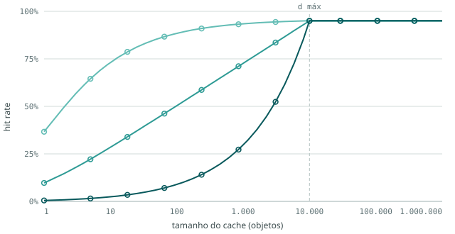

*Figura 1 — Curva de hit rate LRU das três cargas completas (fase `f03`). Eixo x: tamanho do cache
em objetos, em escala log. Eixo y: hit rate. Linhas: valor medido na carga; círculos: valor teórico
calculado da distribuição. Cores: turquesa claro = SD baixa (β = 1,5), turquesa médio = SD média (β = 1,0), turquesa escuro = SD alta (β = 0,5). A linha tracejada vertical marca `d_max` = 10.000, a partir do
qual as três curvas chegam ao teto de 0,95 (os 5% restantes são objetos novos).*

A SD baixa já acerta 73% com um cache de 10 objetos; a SD alta precisa de mais de 1.000 objetos para
passar de 30%. A SD média é uma reta nesse gráfico: o hit rate cresce o mesmo tanto a cada vez que o
cache é multiplicado por dez, como descrito na seção sobre a lei de potência.

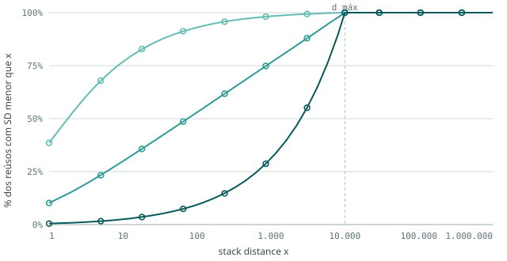

*Figura 2 — Função acumulada da stack distance das cargas completas: para cada distância x, a
fração dos reúsos com stack distance menor que x. Eixo x: stack distance, em escala log. Linhas:
medido; círculos: teórico. Cores: turquesa claro = SD baixa (β = 1,5), turquesa médio = SD média (β = 1,0), turquesa escuro = SD alta (β = 0,5). É a curva de hit da Figura 1 sem os objetos novos — por isso
as duas têm a mesma forma.*

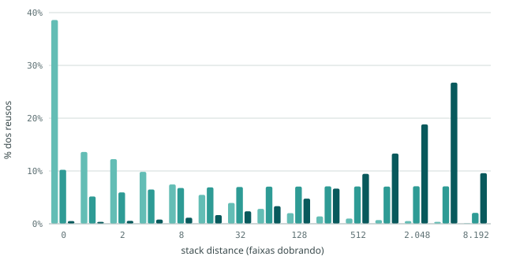

*Figura 3 — Histograma da stack distance das cargas completas: fração dos reúsos em cada faixa de
distância. Eixo x: início de cada faixa (0, depois oitavas 1, 2–3, 4–7, …). Cores: turquesa claro = SD baixa (β = 1,5), turquesa médio = SD média (β = 1,0), turquesa escuro = SD alta (β = 0,5).*

O histograma mostra as três formas da lei de potência: na SD baixa, a maior barra é a da distância
0 e as seguintes diminuem; na SD média, as faixas têm alturas parecidas; na SD alta, as barras
crescem até a última faixa, perto de `d_max`.

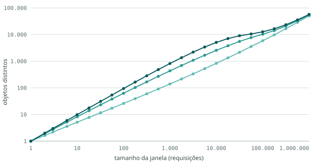

*Figura 4 — Footprint das cargas completas: média de objetos distintos numa janela de N requisições
consecutivas, sobre todas as janelas desse tamanho. Eixos x e y em escala log. Cores: turquesa claro = SD baixa (β = 1,5), turquesa médio = SD média (β = 1,0), turquesa escuro = SD alta (β = 0,5). No extremo
direito, a janela é a carga inteira, e o valor é o total de objetos distintos.*

Nas janelas curtas e médias, as cargas se separam — em 1.000 requisições, 140, 435 e 819 objetos
distintos. Na carga inteira, quase empatam (50 a 57 mil), porque aí o total é dominado pelos
objetos novos, que entram na mesma taxa nas três.

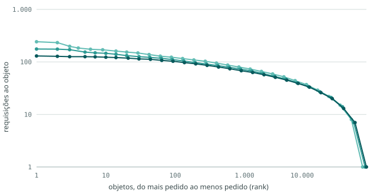

*Figura 5 — Frequência por objeto das cargas completas: os objetos ordenados do mais pedido ao
menos pedido (eixo x, rank, em escala log) e quantas requisições cada um recebeu (eixo y, em escala
log). Cores: turquesa claro = SD baixa (β = 1,5), turquesa médio = SD média (β = 1,0), turquesa escuro = SD alta (β = 0,5).*

As três curvas quase se sobrepõem. A popularidade não é um parâmetro do gerador — ele sorteia a
distância, não o objeto —, e sai praticamente igual nas três cargas, sem a concentração forte que se
vê em tráfego real.

**A referência usada na amostragem.** As amostras são tiradas da carga **sem** o aquecimento do
gerador, que começa com o cache vazio. Essa carga completa "fria" é a referência de todas as
comparações a seguir. Ela difere da teoria só perto do teto: no cache de 10.000 objetos, o hit rate
é 0,950, 0,945 e 0,943 (baixa, média, alta), contra 0,950 teórico; até 1.000 objetos, a diferença
não passa de 0,001.

---

### Parte 2 — As amostras contra a carga completa

Os gráficos desta parte têm todos o mesmo formato: **uma linha por técnica de amostragem** (as três
taxas da sistemática, depois as três da janela com take 1.000 e as três com take 10.000) e **uma
coluna por nível de stack distance**. Em cada faceta, a linha azul contínua é a carga completa e a
linha laranja tracejada é a amostra (nos histogramas, barras azuis e laranja lado a lado).

#### Uma medida que explica boa parte do resto: as primeiras aparições

Uma amostra começa com o cache vazio, e a primeira vez que cada objeto aparece nela é sempre um
miss, qualquer que seja o tamanho do cache. A fração de requisições que são primeira aparição
define o **teto** do hit rate da amostra: nenhum cache, por maior que seja, acerta mais que isso.

| Técnica | SD baixa | SD média | SD alta |
|---|---|---|---|
| carga completa | 5,0% (teto 0,95) | 5,5% (teto 0,95) | 5,7% (teto 0,94) |
| sistemática 1% | 86,1% (teto 0,14) | 85,9% (teto 0,14) | 86,1% (teto 0,14) |
| sistemática 10% | 35,8% (teto 0,64) | 37,2% (teto 0,63) | 38,0% (teto 0,62) |
| sistemática 20% | 21,6% (teto 0,78) | 22,7% (teto 0,77) | 23,3% (teto 0,77) |
| janela 1%, take 1k | 14,0% (teto 0,86) | 42,3% (teto 0,58) | 75,0% (teto 0,25) |
| janela 10%, take 1k | 12,7% (teto 0,87) | 26,9% (teto 0,73) | 36,1% (teto 0,64) |
| janela 20%, take 1k | 11,2% (teto 0,89) | 19,0% (teto 0,81) | 22,8% (teto 0,77) |
| janela 1%, take 10k | 8,6% (teto 0,91) | 26,2% (teto 0,74) | 51,4% (teto 0,49) |
| janela 10%, take 10k | 8,3% (teto 0,92) | 20,8% (teto 0,79) | 32,8% (teto 0,67) |
| janela 20%, take 10k | 7,9% (teto 0,92) | 16,2% (teto 0,84) | 21,6% (teto 0,78) |

*Fração das requisições que são a primeira aparição de um objeto na amostra, e o teto de hit rate
que isso impõe (1 menos essa fração).*

- Na **sistemática**, a fração é praticamente a mesma nos três níveis de SD e depende só da taxa:
  com 1%, 86% das requisições da amostra são primeira aparição, e o hit rate não passa de 0,14.
  A sistemática pega uma requisição a cada 100; em média, cada objeto recebe menos de duas
  requisições na amostra, e a maioria aparece uma vez só.
- Na **janela**, a fração cresce com o nível de SD. Cada trecho contínuo recomeça quase frio, e os
  reúsos que alcançam um objeto de fora do trecho viram primeira aparição. Na SD baixa, quase todo
  reúso é curto e cabe no trecho; na SD alta, a maioria é longa e não cabe. Trechos maiores (take
  10.000) e mais trechos (taxa maior) reduzem a fração.

#### Curva de hit rate

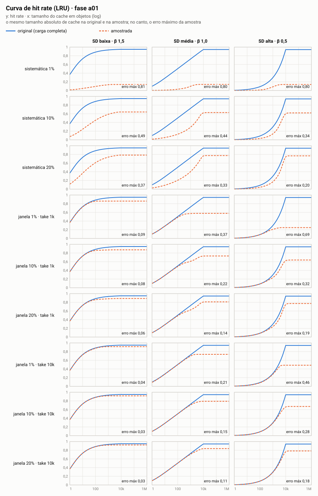

*Figura 6 — Curva de hit rate LRU: carga completa (azul, contínua) contra cada amostra (laranja,
tracejada). Linhas: técnica de amostragem; colunas: nível de SD da carga. Eixo x: tamanho do cache
em objetos, em escala log, com o mesmo tamanho absoluto na amostra e na carga completa. Eixo y: hit
rate, de 0 a 1. No canto de cada faceta, o erro máximo da amostra (a maior diferença absoluta entre
as duas curvas).*

Erro da curva de hit rate de cada amostra em relação à carga completa: **erro máximo**, com o
tamanho de cache em que ele ocorre entre parênteses, e **erro médio absoluto** ao longo da grade.

| Técnica | SD baixa: máx (C) · médio | SD média: máx (C) · médio | SD alta: máx (C) · médio |
|---|---|---|---|
| sistemática 1% | 0,810 (10.000) · 0,758 | 0,804 (10.000) · 0,577 | 0,804 (10.000) · 0,372 |
| sistemática 10% | 0,489 (13) · 0,370 | 0,436 (852) · 0,320 | 0,341 (10.000) · 0,169 |
| sistemática 20% | 0,367 (7) · 0,233 | 0,329 (448) · 0,221 | 0,201 (10.000) · 0,105 |
| janela 1%, take 1k | 0,090 (10.000) · 0,056 | 0,368 (10.000) · 0,179 | 0,693 (10.000) · 0,288 |
| janela 10%, take 1k | 0,076 (10.000) · 0,048 | 0,215 (10.000) · 0,109 | 0,320 (10.000) · 0,130 |
| janela 20%, take 1k | 0,061 (10.000) · 0,040 | 0,139 (10.000) · 0,075 | 0,193 (10.000) · 0,079 |
| janela 1%, take 10k | 0,035 (10.000) · 0,021 | 0,208 (10.000) · 0,090 | 0,456 (10.000) · 0,178 |
| janela 10%, take 10k | 0,033 (10.000) · 0,018 | 0,154 (10.000) · 0,065 | 0,281 (10.000) · 0,104 |
| janela 20%, take 10k | 0,029 (10.000) · 0,015 | 0,109 (10.000) · 0,046 | 0,177 (10.000) · 0,061 |

Hit rate com cache de **100 objetos** (entre parênteses, a diferença para a carga completa):

| Técnica | SD baixa | SD média | SD alta |
|---|---|---|---|
| teórico | 0,884 | 0,503 | 0,089 |
| carga completa | 0,884 | 0,504 | 0,089 |
| sistemática 1% | 0,094 (-0,790) | 0,029 (-0,474) | 0,013 (-0,076) |
| sistemática 10% | 0,450 (-0,434) | 0,129 (-0,374) | 0,032 (-0,057) |
| sistemática 20% | 0,608 (-0,276) | 0,204 (-0,299) | 0,044 (-0,045) |
| janela 1%, take 1k | 0,858 (-0,027) | 0,485 (-0,019) | 0,087 (-0,002) |
| janela 10%, take 1k | 0,859 (-0,026) | 0,488 (-0,015) | 0,087 (-0,002) |
| janela 20%, take 1k | 0,860 (-0,024) | 0,489 (-0,015) | 0,086 (-0,003) |
| janela 1%, take 10k | 0,876 (-0,008) | 0,500 (-0,004) | 0,082 (-0,007) |
| janela 10%, take 10k | 0,880 (-0,005) | 0,502 (-0,002) | 0,088 (-0,001) |
| janela 20%, take 10k | 0,881 (-0,003) | 0,502 (-0,001) | 0,089 (0,000) |

Hit rate com cache de **1.000 objetos**:

| Técnica | SD baixa | SD média | SD alta |
|---|---|---|---|
| teórico | 0,934 | 0,727 | 0,296 |
| carga completa | 0,934 | 0,726 | 0,296 |
| sistemática 1% | 0,134 (-0,801) | 0,098 (-0,628) | 0,085 (-0,211) |
| sistemática 10% | 0,588 (-0,346) | 0,291 (-0,435) | 0,137 (-0,160) |
| sistemática 20% | 0,737 (-0,197) | 0,405 (-0,322) | 0,169 (-0,127) |
| janela 1%, take 1k | 0,860 (-0,074) | 0,574 (-0,153) | 0,208 (-0,088) |
| janela 10%, take 1k | 0,871 (-0,064) | 0,609 (-0,117) | 0,234 (-0,063) |
| janela 20%, take 1k | 0,881 (-0,053) | 0,625 (-0,101) | 0,240 (-0,057) |
| janela 1%, take 10k | 0,914 (-0,020) | 0,699 (-0,028) | 0,278 (-0,018) |
| janela 10%, take 10k | 0,916 (-0,018) | 0,707 (-0,019) | 0,288 (-0,008) |
| janela 20%, take 10k | 0,918 (-0,016) | 0,709 (-0,017) | 0,290 (-0,006) |

- **Todas as amostras subestimam o hit rate.** Nenhuma técnica, em nenhum nível de SD, produziu
  uma curva acima da carga completa por mais de 0,003 (o maior caso é 0,0027, num cache de 4
  objetos).
- **A sistemática erra muito em todos os tamanhos de cache.** Com 1%, o erro máximo é de 0,80 nos
  três níveis — é a diferença entre o teto da carga completa (0,95) e o da amostra (0,14). Com 10% e
  20%, o erro diminui, mas continua acima de 0,20 no máximo. Na SD baixa e na média, o maior erro
  aparece já em caches pequenos (7 a 852 objetos), e não só no teto.
- **A janela acerta os caches pequenos.** Com cache de 100 objetos, as 18 amostras por janela
  ficam a menos de 0,03 da carga completa. O erro cresce conforme o cache se aproxima do tamanho do
  trecho contínuo (1.000 ou 10.000) e passa dele: o maior erro de toda amostra por janela está no
  cache de 10.000 objetos, na região do teto.
- **O erro da janela cresce com o nível de SD.** Com 10% e take 1.000, o erro médio é 0,048 na SD
  baixa, 0,109 na média e 0,130 na alta; o erro máximo, 0,076, 0,215 e 0,320.
- **Na janela, take maior e taxa maior reduzem o erro.** Para a mesma taxa, take 10.000 erra menos
  que take 1.000 nos três níveis. A menor diferença de toda a tabela é a da janela 20% com take
  10.000 (erro médio 0,015, 0,046 e 0,061); a maior, a da sistemática 1% (0,758, 0,577 e 0,372).
- **Na sistemática, o erro médio diminui com o nível de SD** — o contrário da janela. Na SD alta, a
  carga completa já acerta pouco nos caches pequenos, então sobra pouco para a amostra errar ali; o
  erro fica concentrado nos caches grandes.

#### Stack distance

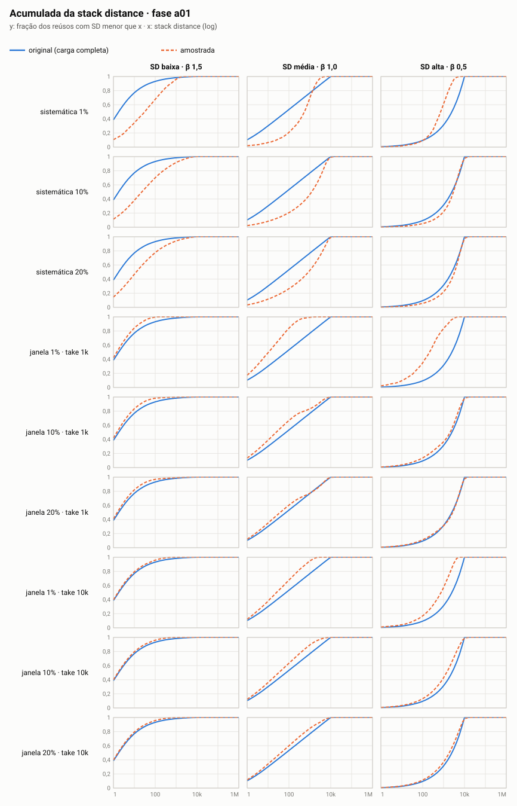

*Figura 7 — Função acumulada da stack distance: para cada distância x, a fração dos reúsos com
stack distance menor que x, na carga completa (azul, contínua) e em cada amostra (laranja,
tracejada). Linhas: técnica; colunas: nível de SD. Eixo x em escala log. A stack distance da
amostra é medida dentro da própria amostra, contando só os objetos que aparecem nela.*

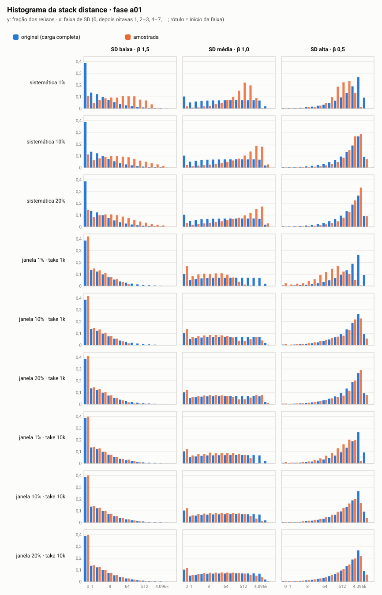

*Figura 8 — Histograma da stack distance: fração dos reúsos em cada faixa de distância, na carga
completa (barras azuis) e na amostra (barras laranja). Linhas: técnica; colunas: nível de SD. Eixo x:
início de cada faixa (0, depois oitavas); rótulos a cada três faixas.*

Mediana (p50) e percentil 90 (p90) da stack distance:

| Técnica | SD baixa: p50 · p90 | SD média: p50 · p90 | SD alta: p50 · p90 |
|---|---|---|---|
| carga completa | 1 · 50 | 72 · 3.632 | 2.501 · 8.073 |
| sistemática 1% | 31 · 540 | 539 · 1.994 | 714 · 2.436 |
| sistemática 10% | 22 · 780 | 1.219 · 5.708 | 2.971 · 7.522 |
| sistemática 20% | 12 · 462 | 856 · 6.116 | 3.379 · 7.989 |
| janela 1%, take 1k | 1 · 17 | 10 · 159 | 211 · 1.602 |
| janela 10%, take 1k | 1 · 19 | 24 · 2.425 | 2.068 · 6.936 |
| janela 20%, take 1k | 1 · 23 | 38 · 3.800 | 2.755 · 7.691 |
| janela 1%, take 10k | 1 · 33 | 25 · 641 | 752 · 2.912 |
| janela 10%, take 10k | 1 · 31 | 32 · 1.079 | 1.396 · 6.099 |
| janela 20%, take 10k | 1 · 32 | 41 · 1.915 | 1.879 · 7.104 |

- **A sistemática empurra as distâncias para cima** nas cargas de SD baixa e média: a mediana vai
  de 1 para 12–31 na SD baixa, e de 72 para 539–1.219 na média. Entre duas requisições ao mesmo
  objeto que sobreviveram à amostragem, costuma haver muitas outras que foram descartadas; o reúso
  que fica na amostra é, em média, muito mais longo que o reúso típico da carga.
- **A janela preserva a SD baixa e encurta as distâncias longas.** Na SD baixa, a mediana continua
  1. Na média e na alta, ela cai (72 para 10–41; 2.501 para 211–2.755), porque só sobrevivem os
  reúsos que cabem dentro de um trecho contínuo; os longos são cortados. Com take 10.000 e taxa
  maior, a distribuição da amostra fica mais perto da completa.
- **Algumas amostras têm distâncias maiores que `d_max`.** Numa amostra, uma distância pode
  atravessar trechos ou lacunas da carga original, então o limite de 10.000 da carga não vale para
  ela (o maior valor chega a cerca de 24 mil).

#### Footprint

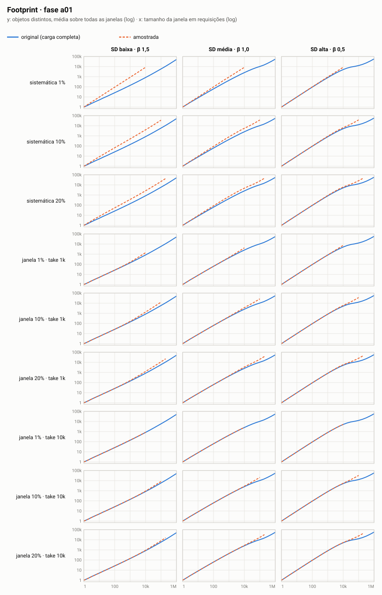

*Figura 9 — Footprint: média de objetos distintos numa janela de N requisições consecutivas, na
carga completa (azul, contínua) e na amostra (laranja, tracejada). Linhas: técnica; colunas: nível
de SD. Eixos x e y em escala log. A curva da amostra termina antes, porque a amostra tem menos
requisições.*

Objetos distintos, em média, numa janela de 1.000 requisições:

| Técnica | SD baixa | SD média | SD alta |
|---|---|---|---|
| carga completa | 140 | 435 | 819 |
| sistemática 1% | 884 | 936 | 950 |
| sistemática 10% | 502 | 798 | 921 |
| sistemática 20% | 364 | 712 | 900 |
| janela 1%, take 1k | 163 | 480 | 846 |
| janela 10%, take 1k | 160 | 471 | 840 |
| janela 20%, take 1k | 159 | 468 | 839 |
| janela 1%, take 10k | 145 | 439 | 825 |
| janela 10%, take 10k | 143 | 439 | 821 |
| janela 20%, take 10k | 142 | 439 | 820 |

- **A janela reproduz o footprint da carga** nas janelas curtas: com take 10.000, os valores ficam a
  menos de 4% dos da carga completa; com take 1.000, a até 17% (na SD baixa).
- **A sistemática infla o footprint.** Mil requisições da amostra de 1% correspondem a cerca de 100
  mil requisições da carga original, e cobrem muito mais objetos distintos: 884 contra 140 na SD
  baixa. Os três níveis de SD ficam quase iguais nessa amostra (884, 936, 950), ou seja, a amostra
  perde a diferença de footprint entre eles.

#### Frequência por objeto

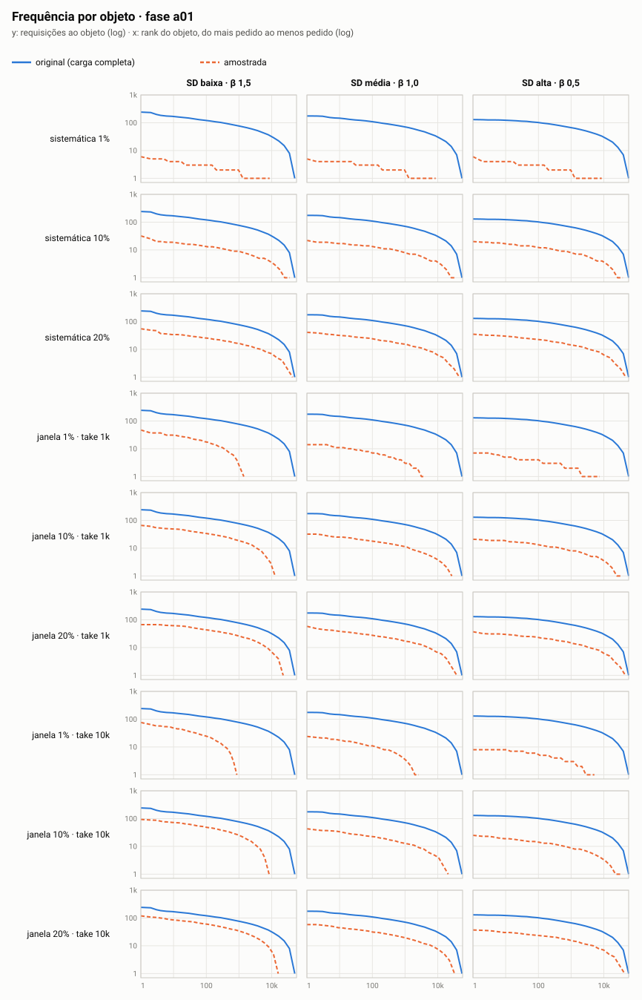

*Figura 10 — Frequência por objeto: objetos ordenados do mais pedido ao menos pedido (eixo x, rank,
em escala log) e quantas requisições cada um recebeu (eixo y, em escala log), na carga completa
(azul, contínua) e na amostra (laranja, tracejada). Linhas: técnica; colunas: nível de SD.*

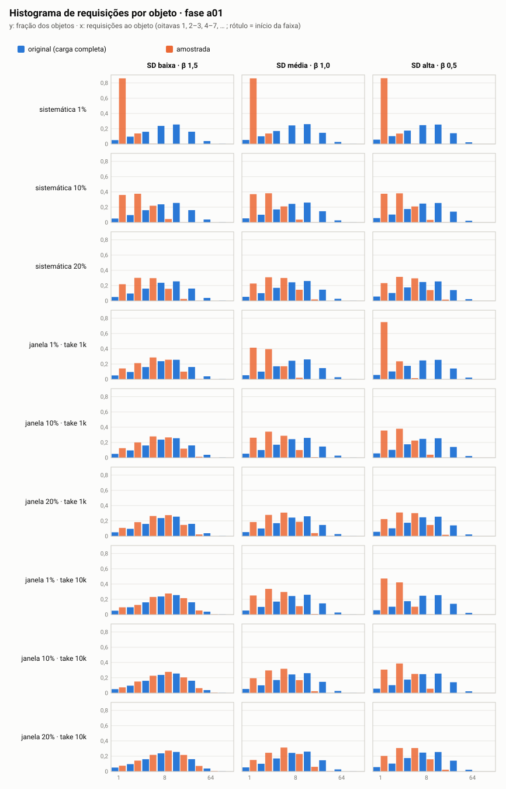

*Figura 11 — Histograma de requisições por objeto: fração dos objetos que recebeu 1, 2–3, 4–7, …
requisições, na carga completa (barras azuis) e na amostra (barras laranja). Linhas: técnica;
colunas: nível de SD.*

Requisições por objeto (média), objetos pedidos uma única vez e fração das requisições que vai para
os 10% de objetos mais pedidos:

| Técnica | SD baixa: média · 1 req · top 10% | SD média: média · 1 req · top 10% | SD alta: média · 1 req · top 10% |
|---|---|---|---|
| carga completa | 19,8 · 5% · 33% | 18,2 · 5% · 32% | 17,5 · 6% · 32% |
| sistemática 1% | 1,2 · 86% · 19% | 1,2 · 86% · 19% | 1,2 · 86% · 19% |
| sistemática 10% | 2,8 · 36% · 29% | 2,7 · 37% · 28% | 2,6 · 38% · 28% |
| sistemática 20% | 4,6 · 22% · 30% | 4,4 · 23% · 30% | 4,3 · 23% · 30% |
| janela 1%, take 1k | 7,1 · 14% · 30% | 2,4 · 41% · 27% | 1,3 · 75% · 21% |
| janela 10%, take 1k | 7,9 · 12% · 30% | 3,7 · 26% · 29% | 2,8 · 36% · 28% |
| janela 20%, take 1k | 8,9 · 11% · 31% | 5,3 · 18% · 30% | 4,4 · 22% · 30% |
| janela 1%, take 10k | 11,6 · 10% · 31% | 3,8 · 25% · 28% | 1,9 · 47% · 24% |
| janela 10%, take 10k | 12,0 · 7% · 31% | 4,8 · 19% · 29% | 3,0 · 31% · 28% |
| janela 20%, take 10k | 12,7 · 7% · 32% | 6,2 · 15% · 30% | 4,6 · 20% · 30% |

- **Toda amostra tem menos requisições por objeto** que a carga completa, como esperado de uma
  fração das requisições. Na sistemática, a curva da Figura 10 é a da carga completa deslocada para
  baixo, quase na proporção da taxa.
- **A fração de objetos pedidos uma vez sobe muito**, de 5% na carga completa para 86% na
  sistemática de 1% — é o mesmo fenômeno das primeiras aparições, visto pelo lado dos objetos.
- **A concentração das requisições nos objetos mais pedidos diminui** (de ~32% para 19–32%). A
  popularidade das cargas, que já era pouco concentrada, fica ainda mais plana nas amostras
  pequenas.

---

### Síntese

- As três cargas completas reproduzem a distribuição de stack distance pedida, com erro máximo de
  0,0008 na curva de hit rate, e diferem fortemente entre si na localidade (mediana 1, 74 e 2.536)
  e quase nada na popularidade.
- As duas técnicas de amostragem subestimam o hit rate da carga completa em todos os cenários
  (a única exceção são diferenças de no máximo 0,003 em caches muito pequenos).
- A **sistemática** tem erros grandes (erro médio de 0,10 a 0,76), que dependem principalmente da
  taxa: a maior parte das requisições da amostra é a primeira aparição de um objeto. Ela também
  distorce a stack distance e o footprint, e apaga boa parte da diferença de footprint entre os
  níveis.
- A **janela** acerta os caches pequenos (erro abaixo de 0,03 com cache de 100 objetos) e preserva
  o footprint em janelas curtas, mas perde os reúsos mais longos que o trecho contínuo. Por isso o
  erro dela cresce com o nível de SD da carga (erro médio de 0,015 a 0,061 no melhor caso, e de
  0,056 a 0,288 no pior) e com o tamanho do cache.
- Em ambas, aumentar a taxa reduz o erro; na janela, aumentar o take também.

---

## Ameaças à validade

- **Nível e espalhamento andam juntos.** Uma distribuição de distâncias pode ser descrita por duas
  características. O **nível** é onde fica a distância típica de um reúso: perto de zero, no meio,
  ou perto de `d_max`. O **espalhamento** é o quanto as distâncias variam entre si: se os reúsos se
  concentram em torno da distância típica, ou se aparecem em todas as faixas, das muito curtas às
  muito longas. Na lei de potência, β mexe nas duas ao mesmo tempo. A carga de SD baixa tem os
  reúsos concentrados perto de zero; a de SD média os tem espalhados por igual em todas as faixas; a
  de SD alta, concentrados perto de `d_max`. Ou seja, as três cargas não diferem só em *onde* está
  a distância típica, mas também em *quão concentradas* estão as distâncias. Uma diferença entre os
  níveis pode vir de qualquer uma das duas coisas. Se isso atrapalhar a interpretação, o caminho é
  repetir com uma forma que tenha um controle para cada característica, como a lognormal, e mudar
  só o nível mantendo o espalhamento fixo.
- **A forma da distribuição é uma escolha.** A literatura descreve a stack distance de cargas web
  ora como lei de potência (Breslau et al., 1999), ora como lognormal (Almeida et al., 1996;
  Barford e Crovella, 1998). Os resultados valem para a família adotada; com uma lognormal de mesma
  mediana, a cauda — e portanto a região de caches grandes — seria outra. O `mkps.py` já constrói
  a lognormal (`mistura` com um componente `lognormal:mediana:sigma`); para repetir o experimento
  com ela, falta o pipeline da geração aceitar essa família nos cenários, que hoje só têm β.
- **Footprint é consequência do nível.** A SD de um reúso é, por definição, a contagem de objetos
  distintos entre dois pedidos. Efeitos atribuídos ao nível de SD são igualmente atribuíveis ao
  footprint.
- **Popularidade plana e passageira.** Os 10% mais pedidos levam cerca de 32% das requisições,
  contra 60% a 80% em tráfego real, e um objeto fica "quente" por estar perto do topo da pilha, não
  por uma propriedade sua. Para LRU isso não afeta nada; para políticas guiadas por frequência
  (parte 2), desfavorece-as por construção.
- **Cargas estacionárias.** Sem ciclo dia/noite, rajadas ou conteúdo que viraliza e esfria. A
  amostragem sistemática e a por janela se comportariam de outro jeito numa carga cuja localidade
  muda ao longo do tempo.
- **Escala das janelas.** Os parâmetros de janela vêm de traces muito maiores. Com 1 milhão de
  requisições, as amostras de 1% por janela são poucos trechos — um só, no caso de take 10.000 —,
  e o resultado delas depende de qual trecho do trace foi tomado.
- **Amostras sem réplica.** Como as técnicas são determinísticas, cada combinação tem uma única
  amostra. Não há como separar, com os dados atuais, o efeito da técnica do efeito da posição
  específica em que ela cortou o trace.
- **Cache vazio no início.** A carga original e as amostras começam frias. Nas amostras curtas, a
  fração de requisições que é primeira aparição de um objeto é maior, e isso pesa no hit rate delas
  independentemente da localidade.
- **Mesmo tamanho absoluto de cache na amostra e na original.** É a convenção do `cache-sampling`
  e a que se adota aqui. Outra convenção — escalar o cache pela taxa de amostragem — daria outros
  números, e os resultados valem para a convenção adotada.
- **Garantia teórica só para LRU.** O gabarito analítico existe para LRU; para as demais políticas
  (parte 2), os números vêm só de simulação.
- **Tamanho unitário.** Não vale para hit rate por byte nem para políticas cientes de tamanho.

---

## Decisões em aberto

1. **Políticas da parte 2.** LRU, FIFO e LFU cobrem três princípios distintos (recência com
   promoção, ordem de chegada, frequência). Falta decidir se entra uma adaptativa — ARC, 2Q ou
   SIEVE — e a grade de tamanhos de cache daquela parte.
2. **Réplicas de amostragem.** A sistemática aceita um deslocamento inicial (começar na linha 1, 2,
   …, *k*) e a janela, um deslocamento das janelas; variar esse deslocamento daria réplicas sem
   mudar a técnica. Hoje os scripts do `cache-sampling` não têm esse parâmetro.
3. **Janelas proporcionais ao tamanho da carga.** Manter os parâmetros do `cache-sampling`
   (comparabilidade com o estudo do X) ou reescalá-los para 1 milhão de requisições (mais trechos
   por amostra).
4. **Grade de cache em fração do footprint.** O `cache-sampling` usa 1, 5, 10, 25, 50 e 75% do
   footprint da carga. Aqui, de 25% para cima o cache passa de `d_max` e a curva da carga original
   já está no teto; a grade logarítmica absoluta cobre essa região e mais. Falta decidir se os
   pontos em fração do footprint também são reportados, para comparação direta.

---

## Reproduzindo este experimento

Tudo roda com a biblioteca padrão do Python 3, a partir da raiz de `cache-locality-lab/`. A pasta
`cache-sampling/` precisa estar ao lado dela (o caminho é configurável no `experimentos.json` da
fase de amostragem).

1. Gerar e conferir as cargas (fase `f03`):
   ```bash
   cd geracao
   python3 pipeline.py --fase f03
   ```
   Saem `fases/f03-experimento/cargas/carga_f03_*.txt` e o relatório de conferência em
   `fases/f03-experimento/analise/relatorio_f03.html`.
2. Amostrar, medir e desenhar (fase `a01`):
   ```bash
   cd ../amostragem
   python3 pipeline.py --fase a01
   ```
   Saem a entrada convertida (`entrada/`), as 27 amostras (`amostras/`), os CSVs de métricas e os
   gráficos em facetas (`analise/`) e o `LEIAME.md` com o significado de cada arquivo.
3. Refazer só as medidas e os gráficos, sem reamostrar:
   ```bash
   python3 pipeline.py --fase a01 --so-analise
   python3 graficos.py --fase a01      # só os gráficos
   ```

A semente está fixa na configuração da fase `f03`, então a mesma configuração gera exatamente as
mesmas cargas, e as técnicas de amostragem são determinísticas. O `manifesto.json` de cada fase
registra os parâmetros, o commit, o hash do código e o hash de cada carga de origem; o pipeline de
amostragem recusa rodar se as cargas da `f03` tiverem mudado desde a amostragem.

## Referências principais

- Mattson et al. *Evaluation techniques for storage hierarchies.* IBM Systems Journal, 1970.
- Turner, Strecker. *Use of the LRU stack depth distribution for simulation of paging behavior.* CACM, 1977.
- Sabnis, Sitaraman. *TRAGEN: a synthetic trace generator for realistic cache simulations.* IMC, 2021.
- Yang, Yue, Rashmi. *A large scale analysis of hundreds of in-memory cache clusters at Twitter.* OSDI, 2020.

Sobre a forma da distribuição de stack distance:

- V. Almeida, A. Bestavros, M. Crovella, A. de Oliveira. *Characterizing reference locality in the
  WWW.* 4th International Conference on Parallel and Distributed Information Systems (PDIS), 1996.
  — caracteriza a localidade temporal pela distribuição de stack distance; cauda longa, descrita
  por lognormal.
- P. Barford, M. Crovella. *Generating representative Web workloads for network and server
  performance evaluation.* ACM SIGMETRICS, 1998. — o gerador SURGE; modela a stack distance com
  lognormal, a partir de Almeida et al.
- L. Breslau, P. Cao, L. Fan, G. Phillips, S. Shenker. *Web caching and Zipf-like distributions:
  evidence and implications.* IEEE INFOCOM, 1999. — hit rate logarítmico no tamanho do cache e
  probabilidade de re-referência após *k* requisições proporcional a 1/*k*.
- M. E. J. Newman. *Power laws, Pareto distributions and Zipf's law.* Contemporary Physics, 46(5),
  2005. — introdução às leis de potência.
- M. Mitzenmacher. *A brief history of generative models for power law and lognormal
  distributions.* Internet Mathematics, 1(2), 2004. — por que lei de potência e lognormal se
  confundem nos dados.
- A. Clauset, C. R. Shalizi, M. E. J. Newman. *Power-law distributions in empirical data.* SIAM
  Review, 51(4), 2009. — como testar se dados seguem mesmo uma lei de potência.

A lista completa está em [`METODOLOGIA.md`](METODOLOGIA.md).
