# Localidade e amostragem de cargas de cache — v3

*Data:* 7 de outubro de 2026
*Dados:* cargas sintéticas da fase `f04` (`geracao/fases/f04-onze-betas/`, 11 × 1 milhão de
requisições) e suas amostras na fase `a02` (`amostragem/fases/a02-temporal-f04/`, 99 amostras).
A fase anterior, `f03` (3 cargas) com as amostras `a01`, está contida nesta: as cargas de β = 1,5,
1,0 e 0,5 da `f04` são idênticas, byte a byte, às da `f03`.
*Código de análise:* `lib/medidas.py` (instrumento de medida), `geracao/pipeline.py`,
`amostragem/pipeline.py`, `amostragem/graficos.py`; técnicas de amostragem em
`cache-sampling/sampling/` (usadas sem modificação)
*Documentos relacionados:* [`METODOLOGIA.md`](METODOLOGIA.md) (o instrumento: como as cargas são
geradas e por que são confiáveis), [`geracao/README.md`](geracao/README.md),
[`amostragem/README.md`](amostragem/README.md)
*Versões anteriores:* v2, com três níveis de β (`f03`/`a01`); v1, com hipóteses e amostragem
espacial (SHARDS).

---

## Contexto

Um cache guarda itens para que pedidos repetidos sejam atendidos sem ir à origem. Quanto ele
acerta depende de quanto a carga **reusa** o que já pediu, e de quão perto no tempo esses reúsos
acontecem. A medida clássica dessa proximidade é a **stack distance** (SD): o número de objetos
distintos requisitados entre dois pedidos ao mesmo objeto. Num cache LRU de C objetos, um reúso
acerta exatamente quando a sua SD é menor que C, e por isso a distribuição de SD determina a curva
de hit rate inteira:

```
hit(C) = (1 − P(∞)) · P(d < C)
```

Avaliar um cache sobre um trace real completo é caro: os traces de produção têm de centenas de
milhões a bilhões de requisições. Uma saída comum é simular sobre uma **amostra** do trace — uma
fração das requisições — e usar o resultado como estimativa do comportamento do trace inteiro. O
`cache-sampling` faz isso com duas técnicas temporais, a **sistemática** e a **por janela**, sobre
traces do X (antigo Twitter).

Em traces reais, porém, a localidade é uma característica herdada do dado: ninguém a controla.
Quando uma amostra erra, não há como separar o quanto do erro vem da técnica e o quanto vem da
localidade daquela carga específica. Aqui a localidade é **manipulada**: as cargas são sintéticas,
com a distribuição de SD definida por um parâmetro, e a curva de hit rate de um cache LRU é
conhecida analiticamente antes de qualquer simulação. Isso permite aplicar as mesmas técnicas de
amostragem a cargas de localidade conhecida e observar como cada uma responde a ela.

**O que este experimento não é.** Não é uma afirmação sobre tráfego real. As cargas são
estacionárias, os objetos têm todos o mesmo tamanho e a popularidade é uma consequência, não um
parâmetro. Os resultados descrevem o mecanismo — como cache e amostragem respondem ao nível de
stack distance —, não o comportamento de uma CDN ou de um servidor específico.

## Objetivo

1. Como o nível de stack distance de uma carga afeta a curva de hit rate de um cache?
2. Para cada técnica e taxa de amostragem, quanto a amostra reproduz a carga original — na curva
   de hit rate, na distribuição de stack distance, no footprint e na frequência por objeto — e
   como isso muda com o nível de stack distance da carga?
3. *(Parte 2, a detalhar.)* Como o nível de stack distance afeta o desempenho relativo das
   políticas de despejo?

---

## Desenho do experimento

O laboratório tem três partes, que consomem as **mesmas onze cargas**:

```
Parte 1 — geração        Parte 3 — amostragem                        Parte 2 — simulação
11 cargas, uma por  →    9 amostras por carga (técnica × taxa),  →   políticas de despejo
nível de SD              medidas contra a carga original             sobre as cargas (a detalhar)
geracao/                 amostragem/                                 simulacao/
```

### As cargas

Cada carga é gerada pelo **LRU Stack Model** (Mattson et al., 1970; Turner e Strecker, 1977): a
cada requisição, sorteia-se uma profundidade *d* de uma distribuição-alvo e requisita-se o objeto
que está nessa profundidade da pilha LRU; com probabilidade P(∞), requisita-se um objeto novo. A
distribuição-alvo é uma lei de potência, P(d) ∝ (d+1)^−β, e **só o β muda entre as cargas**.

| Carga | β | SD mediana | SD p90 | Objetos distintos | Footprint em 1.000 req |
|---|---|---|---|---|---|
| `sd01-b300` | 3,0 | 0 | 1 | 49.518 | 54 |
| `sd02-b250` | 2,5 | 0 | 2 | 49.525 | 58 |
| `sd03-b200` | 2,0 | 0 | 5 | 49.576 | 73 |
| `sd04-b175` | 1,75 | 0 | 12 | 49.752 | 93 |
| `sd05-b150` | 1,5 | 1 | 51 | 50.489 | 140 |
| `sd06-b125` | 1,25 | 6 | 571 | 52.412 | 244 |
| `sd07-b100` | 1,0 | 74 | 3.769 | 54.852 | 435 |
| `sd08-b075` | 0,75 | 869 | 6.824 | 56.459 | 658 |
| `sd09-b050` | 0,5 | 2.536 | 8.119 | 57.264 | 819 |
| `sd10-b025` | 0,25 | 3.971 | 8.694 | 57.680 | 908 |
| `sd11-b000` | 0,0 | 5.000 | 9.003 | 57.929 | 954 |

*Medido na fase `f04`, com o aquecimento do gerador. Os nomes vão de `sd01` (β mais alto, stack
distance mais baixa) a `sd11` (β = 0, stack distance mais alta); o sufixo é o β × 100. As três
cargas da versão anterior correspondem a `sd05-b150` (SD baixa), `sd07-b100` (SD média) e
`sd09-b050` (SD alta). Em todas as onze, a curva de hit medida difere da teórica em no máximo 0,0008,
contra um limite aceito de 0,0025. A escolha dos onze valores está explicada em "Os valores
escolhidos, e por quê".*

### As técnicas de amostragem

As duas técnicas são as do `cache-sampling`, com os mesmos scripts, taxas e janelas.

**Sistemática.** Toma uma requisição a cada *k*: a cada 100 para 1%, a cada 10 para 10%, a cada
5 para 20%. A amostra se espalha uniformemente pelo trace, mas cada requisição fica isolada das
vizinhas.

**Por janela.** Divide o trace em janelas de tamanho fixo e toma as últimas *take* requisições de
cada janela, preservando trechos contínuos do trace. Roda com dois valores de *take*:

| Taxa | Janela (take = 1.000) | Janela (take = 10.000) |
|---|---|---|
| 1% | 100.000 | 1.000.000 |
| 10% | 10.000 | 100.000 |
| 20% | 5.000 | 50.000 |

Antes de amostrar, cada carga é convertida para o formato que o `cache-sampling` espera
(`timestamp,id,tamanho`, sem cabeçalho). O timestamp vira a posição da requisição na carga e o
tamanho é 1; com TTL infinito e cache contado em objetos, nenhum dos dois altera o resultado.

### O instrumento de medida

Todas as métricas saem de `lib/medidas.py`, o mesmo módulo que confere as cargas na geração, e
são aplicadas **com a mesma régua** à carga original e a cada amostra. A curva de hit rate LRU é
calculada a partir das stack distances (algoritmo de Mattson): uma única passada pelo trace dá o
hit rate exato de **todos** os tamanhos de cache ao mesmo tempo, sem uma simulação por tamanho.

O resultado foi conferido contra o simulador do `cache-sampling` (`cache-simulator`, em Go),
rodado sobre os mesmos arquivos: os dois dão o mesmo hit rate até a quarta casa — por exemplo,
0,1293 para a amostra sistemática de 10% da carga de SD média, com cache de 100 objetos.

### Aquecimento

O gerador emite, antes da carga, um **prefixo de aquecimento** de `d_max` = 10.000 linhas, que
deixa um cache LRU no mesmo estado da pilha inicial do gerador. Esse prefixo é um artefato do
gerador, não parte da carga, e é **descartado antes da amostragem**.

Assim, a carga original e as amostras são medidas do mesmo jeito que o simulador as veria:
começando com o cache vazio, sem descartar nada. É a mesma referência que o `cache-sampling` usa
(o trace completo simulado do zero). A diferença para a carga aquecida é pequena — a SD mediana da
carga média fica em 72, contra 74 com aquecimento —, e a curva teórica é reportada ao lado como
terceira referência.

### Cenários

Cada cenário é uma combinação de **carga** com **forma de observá-la**: a carga original inteira
ou uma das nove amostras. São 11 cargas × (1 original + 9 amostras) = **110 traces**, cada um
medido em toda a grade de tamanhos de cache.

| Técnica (nome no arquivo) | Método | Taxa | Janela | Take | Linhas | Trechos contínuos |
|---|---|---|---|---|---|---|
| `completa` | — (referência) | 100% | — | — | 1.000.000 | 1 |
| `sis-p01` | sistemática | 1% | — | — | 10.001 | 10.001 |
| `sis-p10` | sistemática | 10% | — | — | 100.001 | 100.001 |
| `sis-p20` | sistemática | 20% | — | — | 200.001 | 200.001 |
| `jan-p01-t1k` | janela | 1% | 100.000 | 1.000 | 10.000 | 10 |
| `jan-p10-t1k` | janela | 10% | 10.000 | 1.000 | 100.000 | 100 |
| `jan-p20-t1k` | janela | 20% | 5.000 | 1.000 | 200.000 | 200 |
| `jan-p01-t10k` | janela | 1% | 1.000.000 | 10.000 | 10.000 | 1 |
| `jan-p10-t10k` | janela | 10% | 100.000 | 10.000 | 100.000 | 10 |
| `jan-p20-t10k` | janela | 20% | 50.000 | 10.000 | 200.000 | 20 |

Os arquivos seguem o padrão `amostra_<fase>_<carga>_<técnica>.csv` — por exemplo,
`amostra_a02_sd07-b100_jan-p10-t1k.csv` é a amostra por janela de 10%, take 1.000, da carga de
β = 1,0. A sistemática tem uma linha a mais porque o script copia a primeira linha do arquivo antes
de começar a contar (ver `amostragem/README.md`).

---

## Variáveis do experimento

### Variáveis independentes

- **Nível de stack distance da carga:** a velocidade com que a probabilidade de reúso cai
  conforme a distância cresce (β da lei de potência).
  - Valores: β = 3,0; 2,5; 2,0; 1,75; 1,5; 1,25; 1,0; 0,75; 0,5; 0,25; 0,0 (onze níveis, do
    mais baixo ao mais alto de stack distance)
- **Técnica de amostragem:** como as requisições da amostra são escolhidas.
  - Valores: sistemática; por janela
- **Take:** quantas requisições contínuas a amostragem por janela toma de cada janela.
  - Valores: 1.000; 10.000 (só para a técnica por janela)
- **Taxa de amostragem:** fração das requisições da carga que entram na amostra.
  - Valores: 1%, 10%, 20% (e 100%, a carga original, como referência)
- **Tamanho do cache:** número de objetos que o cache comporta. É o eixo das curvas de resposta,
  com o **mesmo tamanho absoluto** na amostra e na carga original.
  - Valores: grade logarítmica entre 1 e 1.000.000 objetos (43 pontos), mais `d_max` e os
    tamanhos de conferência (1, 10, 100, 1.000, 10.000) — 47 tamanhos ao todo
- **Política de despejo:** qual item sai quando o cache está cheio.
  - Valores: LRU nas partes 1 e 3.

### Variáveis controladas - geração da carga

| Variável | Valor |
|---|---|
| Requisições por carga | 1.000.000 |
| Objetos novos, P(∞) | 0,05 do total de requisições |
| Alcance do reúso, `d_max` | 10.000 |
| Família da distribuição de SD | lei de potência, P(d) ∝ (d+1)^−β |
| Tamanho dos itens | todos iguais (1) |
| Semente do gerador | 7 — uma carga por nível |
| Aquecimento do gerador | 10.000 linhas, descartadas antes da amostragem |
| Estado inicial do cache | vazio, na carga original e nas amostras |
| TTL | infinito (nenhum item expira) |
| Controle de admissão | desligado |
| Réplicas de cache | 1 |

### Variáveis dependentes

- **Resultado de cada requisição num cache LRU de C objetos:**
  - "hit" quando o objeto está no cache (reúso com SD < C);
  - "miss" quando não está — seja a primeira vez que o objeto aparece no trace, seja um reúso
    com SD ≥ C.
- **Stack distance de cada requisição:** objetos distintos desde o pedido anterior ao mesmo
  objeto, ou ∞ na primeira aparição.
- **Número de requisições recebidas por cada objeto.**
- **Objetos distintos em cada janela de N requisições consecutivas.**

### Métricas

- **Hit rate:** fração das requisições com resultado "hit", para cada tamanho de cache (a curva de
  hit rate). *Arquivo:* `hrc_<fase>.csv`.
- **Erro de estimativa da curva:** hit rate da amostra menos hit rate da carga original, no mesmo
  tamanho de cache. Resumido por amostra como **erro máximo** (e o tamanho de cache em que ocorre)
  e **erro médio absoluto** ao longo da grade — como a grade é logarítmica, cada década de tamanho
  de cache pesa o mesmo na média. *Arquivos:* `hrc_<fase>.csv`, `medidas_<fase>.csv`.
- **Distribuição de stack distance:** percentis (p25, p50, p75, p90, p99), maior SD, função
  acumulada e histograma em faixas de oitava. *Arquivos:* `medidas_`, `sd_cdf_`,
  `sd_histograma_<fase>.csv`.
- **Footprint:** média de objetos distintos por janela de N requisições, para N de 1 até o trace
  inteiro; em um número, o valor em N = 1.000 e o total de objetos distintos. *Arquivos:*
  `footprint_`, `medidas_<fase>.csv`.
- **Frequência por objeto:** curva rank × requisições, histograma de requisições por objeto,
  média, fração de objetos pedidos uma única vez, fração das requisições que vai para o 1% e para
  os 10% mais pedidos. *Arquivos:* `frequencia_`, `frequencia_hist_`, `medidas_<fase>.csv`.
- **Tamanho efetivo da amostra:** linhas, fração real da carga e número de trechos contínuos.
  *Arquivo:* `amostras_<fase>.csv`.
  
Cada métrica tem um gráfico em facetas (`analise/<métrica>_<fase>.svg`): uma linha por técnica de
amostragem, uma coluna por nível de SD e, em cada faceta, a carga original contra a amostrada, com
os mesmos eixos em toda a figura.

---

## Os valores escolhidos, e por quê

Boa parte destes valores é arbitrária no sentido de que outros valores próximos serviriam. O que
não é arbitrário é a **razão de ordem de grandeza** entre eles: é ela que garante que as diferenças
entre os cenários caibam na faixa medida.

**Um milhão de requisições por carga.** O desvio esperado de uma proporção medida em *n*
requisições é 0,5/√n; com 1 milhão, 0,0005. O aquecimento de 10.000 linhas é 1% da carga. E é
barato: gerar e conferir as três cargas levou 34 segundos, e amostrar e medir as 27 amostras, 35.

**Objetos novos: P(∞) = 0,05.** A fração é sobre o total de requisições: numa carga de 1 milhão,
cerca de 50 mil são a estreia de um objeto. Nos modelos de tráfego real distribuídos com o TRAGEN,
essa fração vai de 4% (downloads) a 42% (mídia social); o valor escolhido fica na ponta baixa, o
regime em que a localidade tem espaço para importar, e deixa o teto do hit rate em 0,95. É igual
nos três níveis, para que a taxa de novidade não se confunda com a localidade.

**`d_max` = 10.000: o alcance do reúso.** É a maior SD que a distribuição pode sortear, e portanto
o tamanho de cache a partir do qual a curva LRU da carga original chega ao teto. Não é o tamanho do
acervo: objetos novos entram o tempo todo, e as cargas terminam com 50 a 57 mil objetos distintos.

**A lei de potência.**

*De que probabilidade se está falando.* O gerador monta a carga uma requisição por vez. Para cada
requisição, ele primeiro decide se ela é um objeto novo ou o reúso de um objeto que já apareceu.
Se for um reúso, ele precisa decidir **qual** objeto antigo pedir, e decide escolhendo uma stack
distance: "peça o objeto que foi usado há *d* objetos distintos atrás". A lei de potência é a regra
que diz com que frequência cada distância é escolhida. Então, toda vez que este texto fala em "a
probabilidade de uma distância", é isto: entre os reúsos da carga, que fração tem aquela distância.

*O que a lei de potência faz com as distâncias.* Ela segue duas regras.

- **Quanto maior a distância, menos ela é escolhida.** Pedir de novo algo que acabou de ser usado
  é o mais comum; pedir algo usado há muito tempo é mais raro. Cada distância é um pouco menos
  provável que a anterior.
- **A queda é proporcional, não absoluta.** A lei de potência não diz "a cada passo, perde-se
  tanto"; diz "quando a distância dobra, a chance cai na mesma proporção". Passar da distância 1
  para a 2 reduz a chance na mesma proporção que passar da 1.000 para a 2.000. Por isso as
  distâncias longas ficam raras, mas **nunca desaparecem**: a chance vai diminuindo devagar, sem
  um ponto a partir do qual ela praticamente zera. É isso que se chama de **cauda longa** — a
  maioria dos reúsos é curta, mas sempre sobra uma parte de reúsos muito longos.

Outras regras de queda não se comportam assim. Numa queda exponencial, por exemplo, cada passo
multiplica a chance pelo mesmo fator; depois de algumas centenas de passos ela já é tão pequena que,
na prática, nenhum reúso longo acontece. A lei de potência foi escolhida justamente por manter os
reúsos longos existindo.

*O que β controla.* β é a **velocidade dessa queda**. Com β alto, a chance cai depressa conforme a
distância cresce; com β baixo, cai devagar, e distâncias longas continuam relativamente comuns.

*Por que três valores de β dão cargas tão diferentes.* Há duas forças puxando em sentidos opostos.
A primeira é a que acabou de ser descrita: cada distância longa, individualmente, é menos provável
que uma curta. A segunda é que **existem muito mais distâncias longas do que curtas**. Entre 1 e 9
há 9 distâncias possíveis; entre 1.000 e 9.999, há 9.000. Mesmo que cada uma dessas 9.000 seja rara,
juntas elas podem somar muito. O que acontece com a carga depende de qual das duas forças vence, e
é β que decide:

- **β alto (SD baixa):** a queda é tão rápida que vence a quantidade. Quase todos os reúsos ficam
  nas distâncias curtas, e as longas, mesmo sendo muitas, somam pouco.
- **β intermediário (SD média):** as duas forças empatam. Cada faixa de distâncias — de 1 a 9, de
  10 a 99, de 100 a 999, e assim por diante — recebe a mesma fatia dos reúsos. Uma consequência
  direta: aumentar o cache de 10 para 100 objetos ganha o mesmo tanto de hit rate que aumentar de
  100 para 1.000, porque cada faixa nova que passa a caber no cache traz a mesma quantidade de
  reúsos. É exatamente esse comportamento — o hit rate crescendo o mesmo tanto a cada vez que o
  cache é multiplicado por dez — que Breslau et al. (1999) observaram em caches web reais.
- **β baixo (SD alta):** a queda é tão lenta que a quantidade vence. Como há muito mais distâncias
  longas, a maior parte dos reúsos fica nelas, perto do limite `d_max`.

O gráfico `sd_histograma` da fase de amostragem mostra essas três formas lado a lado, na linha da
carga original.

*Por que usar a lei de potência.*

1. **Ela reproduz a cauda longa que se vê em cargas reais.** Os estudos de cargas web concordam que
   a maior parte dos reúsos é curta, mas que uma parte não desprezível é muito longa. Uma regra sem
   cauda longa, como a exponencial, produziria cargas em que reúsos longos simplesmente não
   existem, e isso não corresponde ao que se mede.
2. **Um único controle leva de um extremo ao outro.** Mexendo só em β, a carga vai de "quase todo
   reúso é imediato" até "quase todo reúso é distante", passando pelo caso intermediário em que
   todas as faixas de distância pesam igual. Isso permite montar os três níveis do experimento
   mudando uma coisa só.

*A ressalva.* A lei de potência não é a única forma usada para descrever cargas reais. Breslau et
al. (1999) encontram um comportamento compatível com ela; Almeida et al. (1996), que foram os
primeiros a descrever a localidade das cargas web pela stack distance, e o gerador SURGE (Barford e
Crovella, 1998) usam outra forma, a **lognormal**, que também tem cauda longa. Com os dados reais,
é difícil dizer qual das duas se ajusta melhor (Mitzenmacher, 2004; Clauset, Shalizi e Newman,
2009). Por isso a escolha da lei de potência é tratada como uma decisão do experimento, e não como
um fato sobre as cargas reais. Para uma introdução às leis de potência, o texto de referência é
Newman (2005).

A lei de potência tem ainda uma limitação que importa para a interpretação: ao mudar β, a carga
muda em dois aspectos ao mesmo tempo, e não em um só — ver "Nível e espalhamento andam juntos", em
Ameaças à validade.

**Os onze valores de β.** A pergunta é onde vale a pena ter cargas: em que faixa de β a carga
muda de fato, e onde ela já não muda mais. A resposta sai direto das distribuições, sem gerar
carga nenhuma. A tabela mostra, para β de 0 a 5, como fica a distribuição de stack distance e a
curva de hit esperada (com `d_max` = 10.000 e P(∞) = 0,05, os valores de todas as fases):

| β | Reúsos com d = 0 | SD mediana | SD p90 | SD p99 | hit C = 1 | hit C = 10 | hit C = 100 | hit C = 1.000 |
|---|---|---|---|---|---|---|---|---|
| 0,0 | 0,0% | 5.000 | 9.000 | 9.900 | 0,000 | 0,001 | 0,009 | 0,095 |
| 0,25 | 0,1% | 3.971 | 8.690 | 9.866 | 0,001 | 0,005 | 0,030 | 0,169 |
| 0,5 | 0,5% | 2.536 | 8.113 | 9.802 | 0,005 | 0,024 | 0,089 | 0,296 |
| 0,75 | 2,7% | 869 | 6.815 | 9.639 | 0,026 | 0,098 | 0,240 | 0,495 |
| 1,0 | 10,2% | 74 | 3.757 | 9.067 | 0,097 | 0,284 | 0,503 | 0,727 |
| 1,25 | 23,8% | 6 | 567 | 6.710 | 0,226 | 0,537 | 0,754 | 0,880 |
| 1,5 | 38,6% | 1 | 50 | 1.896 | 0,366 | 0,731 | 0,884 | 0,934 |
| 1,75 | 51,0% | 0 | 12 | 253 | 0,484 | 0,840 | 0,930 | 0,947 |
| 2,0 | 60,8% | 0 | 5 | 59 | 0,578 | 0,895 | 0,944 | 0,949 |
| 2,5 | 74,5% | 0 | 2 | 13 | 0,708 | 0,936 | 0,950 | 0,950 |
| 3,0 | 83,2% | 0 | 1 | 5 | 0,790 | 0,946 | 0,950 | 0,950 |
| 4,0 | 92,4% | 0 | 0 | 2 | 0,878 | 0,950 | 0,950 | 0,950 |
| 5,0 | 96,4% | 0 | 0 | 1 | 0,916 | 0,950 | 0,950 | 0,950 |

*Calculado da distribuição (`mkps.py potencia`), sem simulação. "hit C = …" é o hit rate esperado
de um cache LRU com C objetos.*

A tabela mostra três regiões:

- **De β = 0,75 a β = 1,5, a carga muda muito a cada passo.** A mediana da stack distance cai de
  869 para 1, e o hit rate de um cache de 100 objetos sobe de 0,24 para 0,88. É aqui que cada
  valor de β dá uma carga claramente diferente da vizinha.
- **Acima de β ≈ 2, a carga satura.** Quase todo reúso é imediato (mediana 0, p90 até 5), e um
  cache de 100 objetos já chega ao teto. As cargas só se distinguem nos caches de 1 a 10 objetos.
  Acima de β = 3, praticamente nada muda: com β = 4 e β = 5, 99% dos reúsos ficam abaixo de
  distância 2.
- **Abaixo de β ≈ 0,5, a carga também satura, no outro extremo.** A distribuição se aproxima da
  uniforme, e β = 0 é exatamente a uniforme: toda distância entre 0 e `d_max` tem a mesma chance.
  É o limite natural da família. Valores negativos fariam a chance *crescer* com a distância, o que
  deixa de ser uma lei de potência de queda e foge da pergunta do experimento.

Os onze valores escolhidos cobrem as três regiões: de 0 a 2, de 0,25 em 0,25, onde a carga muda;
mais 2,5 e 3,0, para mostrar a saturação de um lado; e o 0, para mostrar a do outro. Valores acima
de 3 repetiriam a carga de β = 3. Os três valores da versão anterior (1,5, 1,0 e 0,5) continuam no
conjunto, então os resultados de antes fazem parte dos de agora.

Os resultados de amostragem apontam a mesma faixa como a mais informativa: é entre β ≈ 1,75 e
β ≈ 0,5 que o erro das amostras muda (ver "Resultados"). Se for preciso refinar um padrão do erro
em função de β, os candidatos naturais são valores intermediários nessa faixa (0,625, 0,875,
1,125, 1,375, 1,625), e não valores fora dela.

**Taxas e janelas de amostragem.** São as do `cache-sampling`, sem ajuste, para manter os
resultados comparáveis com o estudo sobre os traces do X. Elas foram dimensionadas para traces de
centenas de milhões de linhas; numa carga de 1 milhão, a janela de 1% com take de 10.000 vira um
único trecho contínuo, e a de 1% com take de 1.000, dez trechos. A coluna de trechos contínuos na
tabela de cenários registra isso para cada amostra.

**Uma carga por nível, uma amostra por técnica, sem réplicas.** Para LRU, a curva de hit rate de
cada carga é conhecida analiticamente, e o desvio de uma carga em relação ao seu valor esperado é
medido contra a teoria a cada rodada: fica entre 0,0006 e 0,0008, cerca de mil vezes menor que as
diferenças entre níveis (com cache de 100 objetos, o hit rate vai de 0,88 no nível baixo a 0,50 no
médio e 0,09 no alto). As duas técnicas de amostragem são **determinísticas**: dada a carga, cada
combinação de técnica e taxa produz sempre a mesma amostra. Não há semente a variar, e portanto não
há réplica a fazer sem mudar a técnica.

---

## O tamanho dos itens

**Todos os objetos têm o mesmo tamanho.** A métrica de interesse é o hit rate por requisição; com
tamanhos iguais, ele é idêntico ao hit rate por byte, e a dimensão do tamanho não acrescenta nada
à resposta. Três consequências: a SD é contada em objetos, e um cache de C objetos é exatamente um
cache de capacidade C; não há admissão por tamanho, fragmentação nem a escolha entre despejar um
objeto grande ou vários pequenos; e o viés de tamanho que obriga geradores de tráfego de CDN a
mecanismos especiais não existe.

A limitação, dita de forma clara: os resultados não se transferem automaticamente para caches de
objetos heterogêneos, em que hit rate por byte e por requisição divergem e políticas cientes de
tamanho (GD-Size, AdaptSize) passam a fazer sentido.

## Resultados

Os resultados vêm em duas partes. A primeira descreve as **cargas completas** — como ficaram as onze
cargas geradas e se elas têm a localidade que foi pedida. A segunda compara, métrica por métrica,
**cada amostra com a carga completa de onde ela saiu**. Todos os números estão nos CSVs das pastas
`analise/` das fases `f04` e `a02`, e todos os gráficos são os arquivos SVG gerados pelos pipelines.
Os números das cargas de β = 1,5, 1,0 e 0,5 são os mesmos da versão anterior deste documento.

Nas tabelas da Parte 2, as colunas abreviam as técnicas: "sis 10%" é a sistemática de 10%; "jan 10%
· 1k" é a janela de 10% com take de 1.000 requisições.

### Como ler os gráficos

Algumas escolhas de escala mudam o que os gráficos deixam ver, e vale tê-las em mente antes das
figuras.

- **Eixos em escala logarítmica.** O tamanho do cache, a stack distance, o tamanho da janela e o
  rank do objeto estão em escala log: cada década (de 1 a 10, de 10 a 100, de 100 a 1.000…) ocupa o
  mesmo espaço. Isso deixa ver ao mesmo tempo caches de 1 e de 1 milhão de objetos, mas dá aos
  caches pequenos o mesmo espaço visual que aos grandes.
- **A região depois de `d_max` é plana.** Nas curvas de hit e na acumulada da SD da carga completa,
  tudo acima de 10.000 é uma linha reta no teto: nenhum reúso passa de `d_max`. Essa região ocupa
  duas das seis décadas do eixo.
- **Dois eixos log (footprint e frequência) achatam diferenças.** Quando o eixo vertical também é
  logarítmico, uma diferença de duas vezes aparece como um deslocamento pequeno. As tabelas dão os
  números.
- **Valores zero não aparecem em escala log.** Uma faixa de histograma vazia não tem barra, e o menor
  valor possível da frequência (um objeto pedido uma única vez) fica encostado no piso do gráfico.
- **As faixas dos histogramas têm larguras diferentes.** São oitavas: 1, 2–3, 4–7, 8–15… Cada faixa
  cobre o dobro de valores da anterior; a última vai só até `d_max` − 1, então cobre menos valores
  que o "dobro" sugeriria. A altura da barra (ou a cor da célula, no mapa de calor) é a fração de
  reúsos que cai na faixa inteira.
- **Os gráficos em facetas têm onze colunas.** Uma por β, do 3,0 (à esquerda, stack distance mais
  baixa) ao 0,0 (à direita). São figuras largas, pensadas para serem abertas à parte (o arquivo SVG
  pode ser ampliado sem perder nitidez). Todas as facetas de uma figura usam a mesma escala, o que
  torna a comparação direta, mas esconde diferenças abaixo de ~0,01 no hit rate; os valores estão
  nas tabelas.
- **O erro médio pesa cada década por igual.** Ele é a média do erro absoluto nos 47 tamanhos de
  cache da grade, que é logarítmica. Como a região acima de `d_max` ocupa parte da grade, o erro
  médio inclui a diferença entre os tetos da amostra e da carga completa.

---

### Parte 1 — As cargas completas

**As onze cargas saíram como foram pedidas.** Para cada carga, a curva de hit rate medida foi
comparada com a curva calculada da distribuição, nos 44 tamanhos de cache da conferência. A maior
diferença ficou entre 0,0006 e 0,0008, contra um limite aceito de 0,0025 — a variação esperada de
uma proporção medida em 1 milhão de requisições. Hit rate teórico · medido, em cinco tamanhos de
cache:

| β | C = 1 | C = 10 | C = 100 | C = 1.000 | C = 10.000 |
|---|---|---|---|---|---|
| 3,0 | 0,790 · 0,790 | 0,946 · 0,947 | 0,950 · 0,950 | 0,950 · 0,950 | 0,950 · 0,950 |
| 2,5 | 0,708 · 0,708 | 0,936 · 0,936 | 0,950 · 0,950 | 0,950 · 0,950 | 0,950 · 0,950 |
| 2,0 | 0,578 · 0,578 | 0,895 · 0,895 | 0,944 · 0,945 | 0,949 · 0,950 | 0,950 · 0,950 |
| 1,75 | 0,484 · 0,485 | 0,840 · 0,840 | 0,930 · 0,931 | 0,947 · 0,948 | 0,950 · 0,950 |
| 1,5 | 0,366 · 0,367 | 0,731 · 0,731 | 0,884 · 0,884 | 0,934 · 0,934 | 0,950 · 0,950 |
| 1,25 | 0,226 · 0,227 | 0,537 · 0,537 | 0,754 · 0,754 | 0,880 · 0,880 | 0,950 · 0,950 |
| 1,0 | 0,097 · 0,097 | 0,284 · 0,285 | 0,503 · 0,504 | 0,727 · 0,727 | 0,950 · 0,950 |
| 0,75 | 0,026 · 0,026 | 0,098 · 0,098 | 0,240 · 0,240 | 0,495 · 0,495 | 0,950 · 0,950 |
| 0,5 | 0,005 · 0,005 | 0,024 · 0,024 | 0,089 · 0,089 | 0,296 · 0,296 | 0,950 · 0,950 |
| 0,25 | 0,001 · 0,001 | 0,005 · 0,005 | 0,030 · 0,030 | 0,169 · 0,169 | 0,950 · 0,950 |
| 0,0 | 0,000 · 0,000 | 0,001 · 0,001 | 0,009 · 0,010 | 0,095 · 0,095 | 0,950 · 0,950 |

**Medidas das cargas.**

| Carga | β | SD mediana | SD p90 | SD p99 | Reúsos com d = 0 | Objetos distintos | Footprint em 1.000 req | Top 10% | Erro máx. na conferência |
|---|---|---|---|---|---|---|---|---|---|
| `sd01-b300` | 3,0 | 0 | 1 | 5 | 83,1% | 49.518 | 54 | 32,6% | 0,0006 |
| `sd02-b250` | 2,5 | 0 | 2 | 13 | 74,5% | 49.525 | 58 | 32,1% | 0,0006 |
| `sd03-b200` | 2,0 | 0 | 5 | 60 | 60,8% | 49.576 | 73 | 32,4% | 0,0006 |
| `sd04-b175` | 1,75 | 0 | 12 | 256 | 51,0% | 49.752 | 93 | 32,5% | 0,0006 |
| `sd05-b150` | 1,5 | 1 | 51 | 1.916 | 38,6% | 50.489 | 140 | 32,7% | 0,0006 |
| `sd06-b125` | 1,25 | 6 | 571 | 6.733 | 23,9% | 52.412 | 244 | 32,4% | 0,0007 |
| `sd07-b100` | 1,0 | 74 | 3.769 | 9.075 | 10,2% | 54.852 | 435 | 31,9% | 0,0007 |
| `sd08-b075` | 0,75 | 869 | 6.824 | 9.642 | 2,7% | 56.459 | 658 | 32,0% | 0,0007 |
| `sd09-b050` | 0,5 | 2.536 | 8.119 | 9.804 | 0,5% | 57.264 | 819 | 31,6% | 0,0008 |
| `sd10-b025` | 0,25 | 3.971 | 8.694 | 9.868 | 0,1% | 57.680 | 908 | 31,7% | 0,0007 |
| `sd11-b000` | 0,0 | 5.000 | 9.003 | 9.900 | 0,0% | 57.929 | 954 | 31,7% | 0,0007 |

*"Reúsos com d = 0": fração dos reúsos que pedem de novo o mesmo objeto imediatamente. "Top 10%":
fração das requisições que vai para os 10% de objetos mais pedidos.*

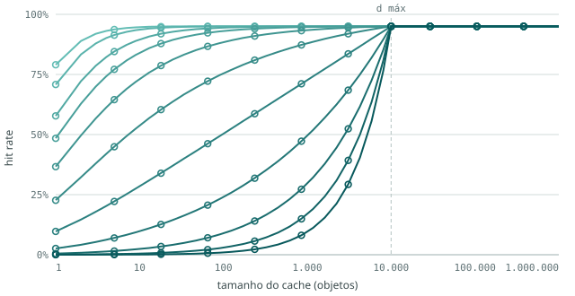

*Figura 1 — Curva de hit rate LRU das onze cargas completas (fase `f04`). Eixo x: tamanho do cache
em objetos, em escala log. Eixo y: hit rate. Linhas: valor medido na carga; círculos: valor teórico
calculado da distribuição. Cores: do turquesa mais claro (β = 3,0, stack distance mais baixa) ao mais escuro (β = 0,0, stack distance mais alta), na ordem dos onze níveis. A linha tracejada vertical marca `d_max` = 10.000, a partir do qual
todas as curvas chegam ao teto de 0,95 (os 5% restantes são objetos novos).*

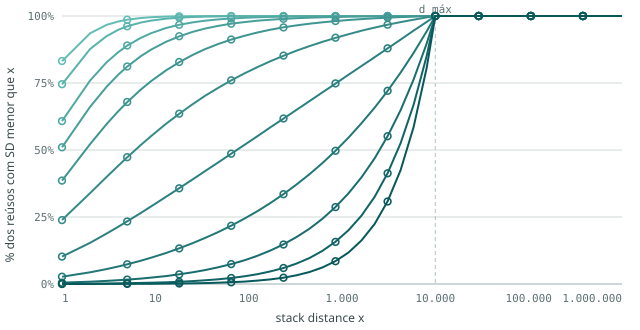

*Figura 2 — Função acumulada da stack distance das cargas completas: para cada distância x, a fração
dos reúsos com stack distance menor que x. Eixo x: stack distance, em escala log. Linhas: medido;
círculos: teórico. Cores: do turquesa mais claro (β = 3,0, stack distance mais baixa) ao mais escuro (β = 0,0, stack distance mais alta), na ordem dos onze níveis. É a curva de hit da Figura 1 sem os objetos novos — por isso as duas têm a
mesma forma.*

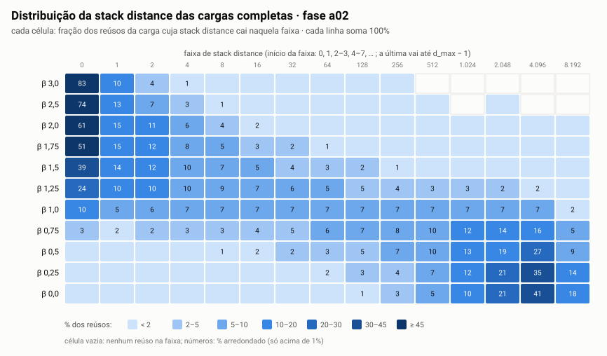

*Figura 3 — Distribuição da stack distance das cargas completas, como mapa de calor. Cada linha é uma
carga (β de 3,0 no alto a 0,0 embaixo); cada coluna, uma faixa de stack distance (rótulo = início
da faixa: 0, 1, 2–3, 4–7, …); a cor e o número em cada célula dão a fração dos reúsos da carga
naquela faixa (escala no rodapé da figura; cada linha soma 100%). Células sem número têm menos de
1%; células vazias, nenhum reúso. Medido nas cargas sem o aquecimento.*

O mapa de calor mostra as três formas da lei de potência lado a lado. Nas cargas de β alto, a massa
está concentrada nas primeiras colunas (com β = 3,0, 83% dos reúsos têm distância 0). Com β = 1,0,
as faixas recebem frações parecidas, de 5% a 10% cada. Com β baixo, a massa se acumula nas últimas
faixas, perto de `d_max`.

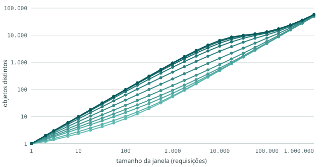

*Figura 4 — Footprint das cargas completas: média de objetos distintos numa janela de N requisições
consecutivas, sobre todas as janelas desse tamanho. Eixos x e y em escala log. Cores: do turquesa mais claro (β = 3,0, stack distance mais baixa) ao mais escuro (β = 0,0, stack distance mais alta), na ordem dos onze níveis. No extremo
direito, a janela é a carga inteira, e o valor é o total de objetos distintos.*

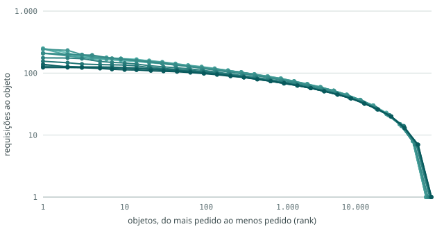

*Figura 5 — Frequência por objeto das cargas completas: os objetos ordenados do mais pedido ao menos
pedido (eixo x, rank, em escala log) e quantas requisições cada um recebeu (eixo y, em escala log).
Cores: do turquesa mais claro (β = 3,0, stack distance mais baixa) ao mais escuro (β = 0,0, stack distance mais alta), na ordem dos onze níveis.*

- **As cargas mudam mais na faixa de β = 0,75 a 1,5.** É onde as curvas da Figura 1 se afastam
  mais umas das outras: com um cache de 100 objetos, o hit rate vai de 0,24 (β = 0,75) a 0,88
  (β = 1,5).
- **Nos extremos, as cargas ficam parecidas.** De β = 2,0 a 3,0, o hit rate com 10 objetos já está
  entre 0,895 e 0,947, e as curvas só se separam no cache de 1 objeto. De β = 0,5 a 0,0, as curvas se
  aproximam da forma da distribuição uniforme, e se separam pouco até 1.000 objetos.
- **O footprint em 1.000 requisições vai de 54 a 954 objetos**, do β mais alto ao mais baixo; na
  carga inteira, as onze ficam entre 49,5 mil e 57,9 mil objetos distintos, porque aí o total é
  dominado pelos objetos novos, que entram na mesma taxa em todas.
- **A popularidade é praticamente a mesma em todas** (os 10% mais pedidos levam entre 31,6% e 32,7%
  das requisições). Ela não é um parâmetro do gerador e não acompanha o β.

**A referência usada na amostragem.** As amostras são tiradas da carga **sem** o aquecimento do
gerador, que começa com o cache vazio. Essa carga completa "fria" é a referência de todas as
comparações a seguir. Ela difere da teoria só perto do teto: no cache de 10.000 objetos, o hit rate
vai de 0,942 (β = 0,0) a 0,951 (β = 3,0), contra 0,950 teórico; até 1.000 objetos, a diferença não
passa de 0,001 em nenhuma das onze.

---

### Parte 2 — As amostras contra a carga completa

Os gráficos em facetas desta parte têm todos o mesmo formato: **uma linha por técnica de
amostragem** (as três taxas da sistemática, depois as três da janela com take 1.000 e as três com
take 10.000) e **uma coluna por carga**, de β = 3,0 a β = 0,0. Em cada faceta, a linha azul
contínua é a carga completa e a linha laranja tracejada é a amostra (nos histogramas, barras azuis
e laranja lado a lado).

#### Uma medida que explica boa parte do resto: as primeiras aparições

Uma amostra começa com o cache vazio, e a primeira vez que cada objeto aparece nela é sempre um
miss, qualquer que seja o tamanho do cache. A fração de requisições que são primeira aparição
define o **teto** do hit rate da amostra: nenhum cache, por maior que seja, acerta mais que 1 menos
essa fração.

| β | completa | sis 1% | sis 10% | sis 20% | jan 1% · 1k | jan 10% · 1k | jan 20% · 1k | jan 1% · 10k | jan 10% · 10k | jan 20% · 10k |
|---|---|---|---|---|---|---|---|---|---|---|
| 3,0 | 5,0% | 92,9% | 38,0% | 22,1% | 5,5% | 5,3% | 5,4% | 5,3% | 5,1% | 5,0% |
| 2,5 | 5,0% | 90,8% | 37,3% | 21,9% | 5,8% | 5,8% | 5,8% | 5,3% | 5,2% | 5,1% |
| 2,0 | 5,0% | 88,0% | 36,6% | 21,7% | 7,2% | 7,2% | 7,1% | 5,7% | 5,5% | 5,4% |
| 1,75 | 5,0% | 87,3% | 36,1% | 21,5% | 9,3% | 9,1% | 8,6% | 6,4% | 6,2% | 6,1% |
| 1,5 | 5,0% | 86,1% | 35,8% | 21,6% | 14,0% | 12,7% | 11,2% | 8,6% | 8,3% | 7,9% |
| 1,25 | 5,2% | 85,5% | 36,3% | 22,0% | 24,3% | 18,9% | 15,0% | 14,5% | 13,2% | 11,6% |
| 1,0 | 5,5% | 85,9% | 37,2% | 22,7% | 42,3% | 26,9% | 19,0% | 26,2% | 20,8% | 16,2% |
| 0,75 | 5,6% | 85,1% | 37,6% | 23,1% | 62,1% | 33,0% | 21,7% | 40,0% | 28,0% | 19,6% |
| 0,5 | 5,7% | 86,1% | 38,0% | 23,3% | 75,0% | 36,1% | 22,8% | 51,4% | 32,8% | 21,6% |
| 0,25 | 5,8% | 85,8% | 38,1% | 23,5% | 82,7% | 37,5% | 23,4% | 59,4% | 35,6% | 22,7% |
| 0,0 | 5,8% | 86,0% | 38,2% | 23,6% | 85,9% | 38,3% | 23,6% | 65,0% | 37,3% | 23,3% |

*Fração das requisições que são a primeira aparição de um objeto (na carga completa, inclui os
objetos novos do gerador e os da pilha inicial).*

- **Na sistemática, a fração depende sobretudo da taxa:** 85% a 93% a 1%, 36% a 38% a 10% e 21% a
  24% a 20%. A sistemática pega uma requisição a cada 100, 10 ou 5, e a chance de um objeto reaparecer
  na amostra depende principalmente de quantas vezes ele é pedido. O β ainda pesa nas cargas de β
  alto (92,9% a 1% com β = 3,0, contra ~86% nas demais): ali os pedidos a um objeto vêm em rajadas,
  quase em sequência, e uma rajada inteira entra na amostra no máximo uma vez.
- **Na janela, a fração cresce com a stack distance da carga.** Com β ≥ 2, ela fica perto dos 5% da
  carga completa: quase todo reúso é curto e cabe dentro de um trecho contínuo. Com β baixo, a maior
  parte dos reúsos é longa, sai do trecho, e vira primeira aparição.
- **Com β = 0,0, a janela de take 1.000 chega exatamente à sistemática da mesma taxa** (85,9% contra
  86,0% a 1%, por exemplo). Sem localidade, tanto faz quais requisições se escolhem.

#### Curva de hit rate

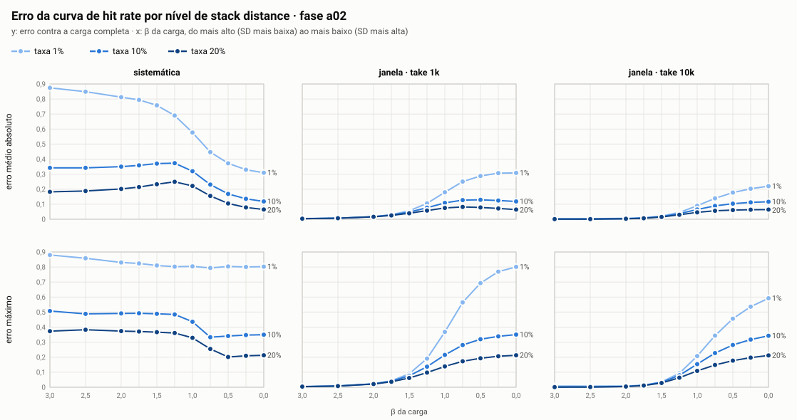

*Figura 6 — Erro da curva de hit rate de cada amostra contra a carga completa, em função do β da
carga. Colunas: família de técnica (sistemática; janela com take 1.000; janela com take 10.000).
Linhas: erro médio absoluto ao longo da grade de caches (em cima) e erro máximo (embaixo). Cada
linha do gráfico é uma taxa de amostragem — 1% (azul claro), 10% (azul médio) e 20% (azul escuro) —,
com o rótulo da taxa no fim da linha. O eixo x vai do β mais alto (stack distance mais baixa) ao mais
baixo, na mesma ordem das colunas das figuras em facetas. Os pontos marcam os onze β medidos; as
linhas entre eles só guiam o olho.*

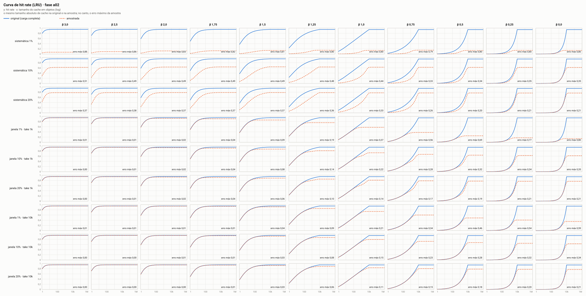

*Figura 7 — Curva de hit rate LRU: carga completa (azul, contínua) contra cada amostra (laranja,
tracejada). Linhas: técnica de amostragem; colunas: carga, de β = 3,0 a 0,0. Eixo x: tamanho do
cache em objetos, em escala log, com o mesmo tamanho absoluto na amostra e na carga completa. Eixo y:
hit rate, de 0 a 1. No canto de cada faceta, o erro máximo da amostra.*

**Erro médio absoluto** da curva de hit rate de cada amostra, em relação à carga completa:

| β | sis 1% | sis 10% | sis 20% | jan 1% · 1k | jan 10% · 1k | jan 20% · 1k | jan 1% · 10k | jan 10% · 10k | jan 20% · 10k |
|---|---|---|---|---|---|---|---|---|---|
| 3,0 | 0,875 | 0,342 | 0,183 | 0,005 | 0,004 | 0,004 | 0,003 | 0,001 | 0,001 |
| 2,5 | 0,849 | 0,342 | 0,188 | 0,008 | 0,007 | 0,007 | 0,004 | 0,002 | 0,001 |
| 2,0 | 0,813 | 0,350 | 0,202 | 0,017 | 0,017 | 0,016 | 0,006 | 0,004 | 0,003 |
| 1,75 | 0,795 | 0,358 | 0,214 | 0,030 | 0,028 | 0,026 | 0,010 | 0,008 | 0,007 |
| 1,5 | 0,758 | 0,370 | 0,233 | 0,056 | 0,048 | 0,040 | 0,021 | 0,018 | 0,015 |
| 1,25 | 0,690 | 0,373 | 0,249 | 0,106 | 0,077 | 0,058 | 0,046 | 0,037 | 0,030 |
| 1,0 | 0,577 | 0,320 | 0,221 | 0,179 | 0,109 | 0,075 | 0,090 | 0,065 | 0,046 |
| 0,75 | 0,447 | 0,231 | 0,155 | 0,250 | 0,127 | 0,082 | 0,139 | 0,089 | 0,056 |
| 0,5 | 0,372 | 0,169 | 0,105 | 0,288 | 0,130 | 0,079 | 0,178 | 0,104 | 0,061 |
| 0,25 | 0,330 | 0,136 | 0,079 | 0,307 | 0,125 | 0,072 | 0,203 | 0,112 | 0,064 |
| 0,0 | 0,309 | 0,118 | 0,065 | 0,308 | 0,119 | 0,064 | 0,220 | 0,117 | 0,064 |

**Erro máximo** (a maior diferença absoluta entre as duas curvas, em qualquer tamanho de cache):

| β | sis 1% | sis 10% | sis 20% | jan 1% · 1k | jan 10% · 1k | jan 20% · 1k | jan 1% · 10k | jan 10% · 10k | jan 20% · 10k |
|---|---|---|---|---|---|---|---|---|---|
| 3,0 | 0,880 | 0,507 | 0,373 | 0,005 | 0,004 | 0,004 | 0,008 | 0,002 | 0,001 |
| 2,5 | 0,858 | 0,488 | 0,383 | 0,009 | 0,008 | 0,008 | 0,008 | 0,002 | 0,001 |
| 2,0 | 0,830 | 0,491 | 0,374 | 0,023 | 0,022 | 0,021 | 0,009 | 0,005 | 0,005 |
| 1,75 | 0,824 | 0,492 | 0,371 | 0,043 | 0,041 | 0,037 | 0,014 | 0,013 | 0,011 |
| 1,5 | 0,810 | 0,489 | 0,367 | 0,090 | 0,076 | 0,061 | 0,035 | 0,033 | 0,029 |
| 1,25 | 0,802 | 0,485 | 0,361 | 0,191 | 0,137 | 0,098 | 0,093 | 0,080 | 0,064 |
| 1,0 | 0,804 | 0,436 | 0,329 | 0,368 | 0,215 | 0,139 | 0,208 | 0,154 | 0,109 |
| 0,75 | 0,794 | 0,333 | 0,255 | 0,565 | 0,281 | 0,173 | 0,343 | 0,227 | 0,148 |
| 0,5 | 0,804 | 0,341 | 0,201 | 0,693 | 0,320 | 0,193 | 0,456 | 0,281 | 0,177 |
| 0,25 | 0,801 | 0,347 | 0,209 | 0,769 | 0,339 | 0,206 | 0,536 | 0,317 | 0,197 |
| 0,0 | 0,802 | 0,350 | 0,213 | 0,801 | 0,351 | 0,213 | 0,592 | 0,342 | 0,212 |

- **Todas as amostras subestimam o hit rate.** Nenhuma técnica, em nenhuma carga, produziu uma curva
  acima da completa por mais de 0,003.
- **Na mesma taxa, a janela nunca erra mais que a sistemática**, e take 10.000 nunca erra mais que
  take 1.000. Taxa maior sempre erra menos. Esses três padrões valem nas onze cargas (com tolerância
  de 0,002).
- **A sistemática erra muito em qualquer carga, e mais quando a stack distance é baixa.** O erro
  médio a 1% vai de 0,875 (β = 3,0) a 0,309 (β = 0,0). O erro máximo muda pouco com β (de 0,79 a
  0,88 a 1%): ele vem do teto baixo da amostra, que depende sobretudo da taxa.
- **A janela quase não erra nas cargas de stack distance baixa e piora quando ela cresce.** Com
  β ≥ 2, o erro médio fica abaixo de 0,02 em todas as janelas. Ele sobe sobretudo entre β = 1,75 e
  β = 0,75 (na janela de 10% com take 1.000, de 0,028 para 0,127) e depois para de crescer.
- **Com β = 0,0, a janela de take 1.000 e a sistemática dão o mesmo erro** (0,308 contra 0,309 a 1%;
  0,119 contra 0,118 a 10%; 0,064 contra 0,065 a 20%). A vantagem da janela depende inteiramente de
  haver localidade na carga.

#### Stack distance

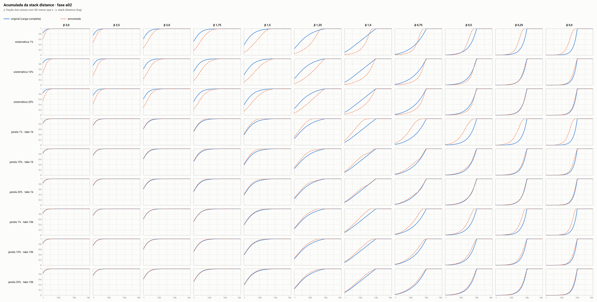

*Figura 8 — Função acumulada da stack distance: para cada distância x, a fração dos reúsos com
stack distance menor que x, na carga completa (azul, contínua) e em cada amostra (laranja,
tracejada). Linhas: técnica; colunas: carga, de β = 3,0 a 0,0. Eixo x em escala log. A stack
distance da amostra é medida dentro da própria amostra, contando só os objetos que aparecem nela.*

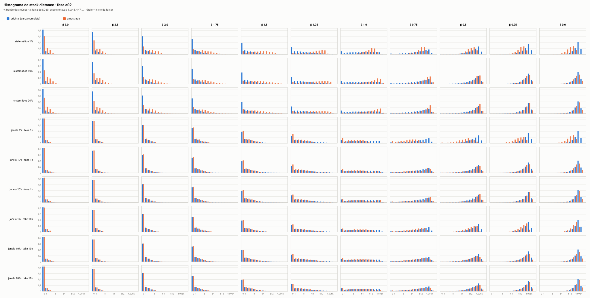

*Figura 9 — Histograma da stack distance: fração dos reúsos em cada faixa de distância, na carga
completa (barras azuis) e na amostra (barras laranja). Linhas: técnica; colunas: carga, de β = 3,0
a 0,0. Eixo x: início de cada faixa (0, depois oitavas); rótulos a cada três faixas.*

Mediana da stack distance:

| β | completa | sis 1% | sis 10% | sis 20% | jan 1% · 1k | jan 10% · 1k | jan 20% · 1k | jan 1% · 10k | jan 10% · 10k | jan 20% · 10k |
|---|---|---|---|---|---|---|---|---|---|---|
| 3,0 | 0 | 0 | 1 | 0 | 0 | 0 | 0 | 0 | 0 | 0 |
| 2,5 | 0 | 1 | 1 | 1 | 0 | 0 | 0 | 0 | 0 | 0 |
| 2,0 | 0 | 3 | 3 | 2 | 0 | 0 | 0 | 0 | 0 | 0 |
| 1,75 | 0 | 6 | 6 | 4 | 0 | 0 | 0 | 0 | 0 | 0 |
| 1,5 | 1 | 31 | 22 | 12 | 1 | 1 | 1 | 1 | 1 | 1 |
| 1,25 | 6 | 188 | 190 | 88 | 3 | 3 | 4 | 4 | 4 | 4 |
| 1,0 | 72 | 539 | 1.219 | 856 | 10 | 24 | 38 | 25 | 32 | 41 |
| 0,75 | 848 | 712 | 2.461 | 2.411 | 51 | 389 | 827 | 210 | 358 | 520 |
| 0,5 | 2.501 | 714 | 2.971 | 3.379 | 211 | 2.068 | 2.755 | 752 | 1.396 | 1.879 |
| 0,25 | 3.937 | 808 | 3.211 | 3.830 | 541 | 2.952 | 3.672 | 1.445 | 2.609 | 3.238 |
| 0,0 | 4.970 | 892 | 3.371 | 4.086 | 893 | 3.349 | 4.081 | 2.114 | 3.612 | 4.203 |

- **A sistemática alonga as distâncias nas cargas de stack distance baixa e média.** Com β = 1,25, a
  mediana vai de 6 para 88–190; com β = 1,0, de 72 para 539–1.219. Entre dois pedidos ao mesmo
  objeto que sobreviveram à amostragem, costuma haver outros pedidos a ele que foram descartados; o
  reúso que fica na amostra junta vários reúsos da carga.
- **Na sistemática de 1%, com β ≤ 0,75, a mediana fica abaixo da completa.** A amostra tem só 10 mil
  requisições e 8,5 a 9,3 mil objetos distintos; a distância, contada dentro dela, não tem como
  chegar aos milhares que a carga completa tem.
- **A janela preserva as distâncias com β ≥ 1,5 e encurta as longas com β menor**, porque só
  sobrevivem os reúsos que cabem num trecho contínuo. Take 10.000 e taxa maior ficam mais perto da
  completa. Com β = 0,0, a janela de take 1.000 volta a coincidir com a sistemática (893 contra 892 a
  1%).

#### Footprint

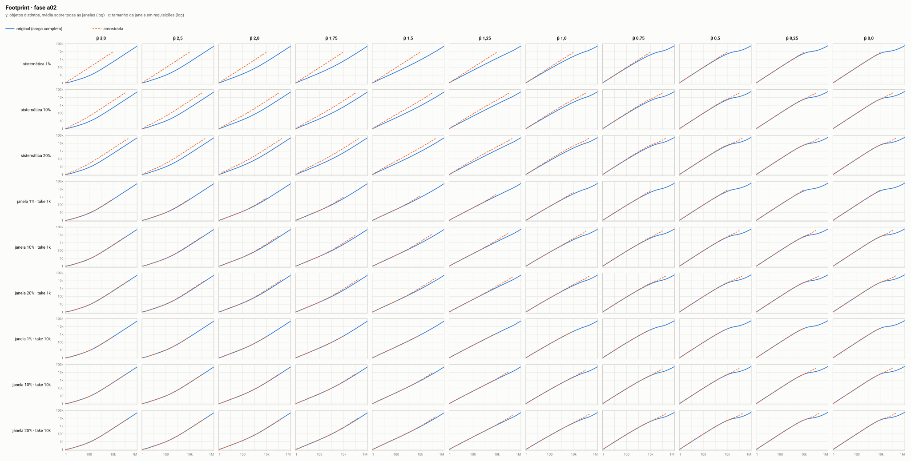

*Figura 10 — Footprint: média de objetos distintos numa janela de N requisições consecutivas, na
carga completa (azul, contínua) e na amostra (laranja, tracejada). Linhas: técnica; colunas: carga,
de β = 3,0 a 0,0. Eixos x e y em escala log. A curva da amostra termina antes, porque a amostra tem
menos requisições.*

Objetos distintos, em média, numa janela de 1.000 requisições:

| β | completa | sis 1% | sis 10% | sis 20% | jan 1% · 1k | jan 10% · 1k | jan 20% · 1k | jan 1% · 10k | jan 10% · 10k | jan 20% · 10k |
|---|---|---|---|---|---|---|---|---|---|---|
| 3,0 | 54 | 928 | 382 | 224 | 58 | 57 | 57 | 57 | 55 | 54 |
| 2,5 | 58 | 907 | 378 | 226 | 64 | 63 | 64 | 61 | 59 | 59 |
| 2,0 | 73 | 881 | 389 | 245 | 84 | 83 | 83 | 75 | 74 | 74 |
| 1,75 | 93 | 880 | 420 | 280 | 109 | 108 | 107 | 96 | 96 | 95 |
| 1,5 | 140 | 884 | 502 | 364 | 163 | 160 | 159 | 145 | 143 | 142 |
| 1,25 | 244 | 908 | 653 | 527 | 277 | 272 | 270 | 251 | 248 | 247 |
| 1,0 | 435 | 936 | 798 | 712 | 480 | 471 | 468 | 439 | 439 | 439 |
| 0,75 | 658 | 944 | 881 | 835 | 699 | 691 | 688 | 663 | 661 | 661 |
| 0,5 | 819 | 950 | 921 | 900 | 846 | 840 | 839 | 825 | 821 | 820 |
| 0,25 | 908 | 955 | 941 | 933 | 925 | 917 | 918 | 914 | 910 | 909 |
| 0,0 | 954 | 958 | 954 | 953 | 958 | 954 | 954 | 958 | 955 | 954 |

- **A janela reproduz o footprint das janelas curtas:** com take 10.000, no máximo 6% acima do da
  carga completa; com take 1.000, no máximo 17% acima.
- **A sistemática infla o footprint, mais quanto menor a stack distance.** Com β = 3,0, mil
  requisições da amostra de 1% têm 928 objetos distintos, contra 54 na carga completa: elas
  correspondem a cerca de 100 mil requisições da carga original. Com β = 0,0 não há diferença (954
  nas duas), porque sem localidade quase toda requisição já é um objeto diferente.

#### Frequência por objeto

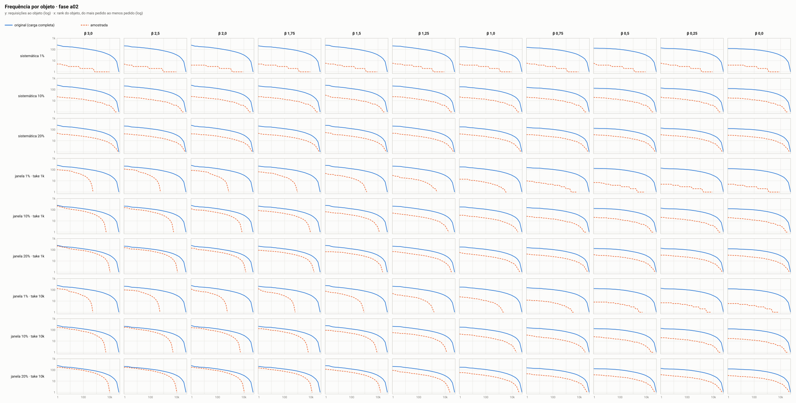

*Figura 11 — Frequência por objeto: objetos ordenados do mais pedido ao menos pedido (eixo x, rank,
em escala log) e quantas requisições cada um recebeu (eixo y, em escala log), na carga completa
(azul, contínua) e na amostra (laranja, tracejada). Linhas: técnica; colunas: carga, de β = 3,0 a
0,0.*

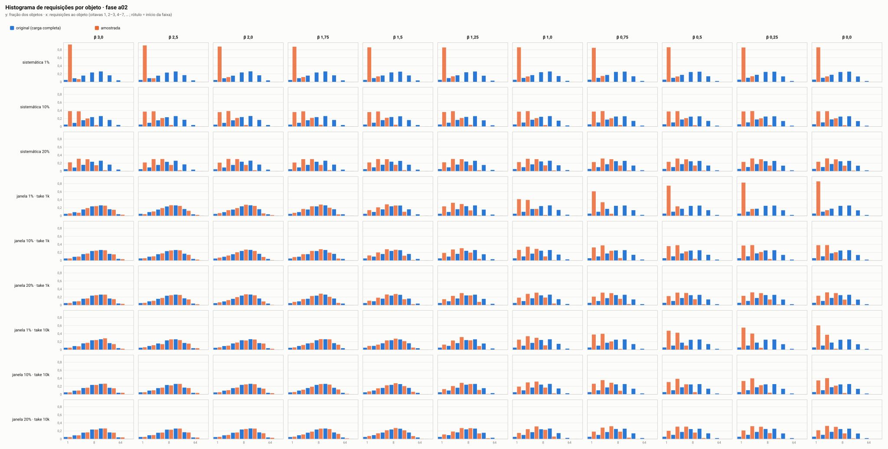

*Figura 12 — Histograma de requisições por objeto: fração dos objetos que recebeu 1, 2–3, 4–7, …
requisições, na carga completa (barras azuis) e na amostra (barras laranja). Linhas: técnica;
colunas: carga, de β = 3,0 a 0,0.*

Requisições por objeto, em média:

| β | completa | sis 1% | sis 10% | sis 20% | jan 1% · 1k | jan 10% · 1k | jan 20% · 1k | jan 1% · 10k | jan 10% · 10k | jan 20% · 10k |
|---|---|---|---|---|---|---|---|---|---|---|
| 3,0 | 20,2 | 1,1 | 2,6 | 4,5 | 18,3 | 18,7 | 18,6 | 18,9 | 19,6 | 19,9 |
| 2,5 | 20,2 | 1,1 | 2,7 | 4,6 | 17,1 | 17,4 | 17,3 | 18,8 | 19,4 | 19,6 |
| 2,0 | 20,2 | 1,1 | 2,7 | 4,6 | 13,8 | 13,9 | 14,1 | 17,7 | 18,2 | 18,4 |
| 1,75 | 20,1 | 1,1 | 2,8 | 4,7 | 10,8 | 11,0 | 11,6 | 15,7 | 16,0 | 16,4 |
| 1,5 | 19,8 | 1,2 | 2,8 | 4,6 | 7,1 | 7,9 | 8,9 | 11,6 | 12,0 | 12,7 |
| 1,25 | 19,1 | 1,2 | 2,8 | 4,5 | 4,1 | 5,3 | 6,7 | 6,9 | 7,6 | 8,6 |
| 1,0 | 18,2 | 1,2 | 2,7 | 4,4 | 2,4 | 3,7 | 5,3 | 3,8 | 4,8 | 6,2 |
| 0,75 | 17,7 | 1,2 | 2,7 | 4,3 | 1,6 | 3,0 | 4,6 | 2,5 | 3,6 | 5,1 |
| 0,5 | 17,5 | 1,2 | 2,6 | 4,3 | 1,3 | 2,8 | 4,4 | 1,9 | 3,0 | 4,6 |
| 0,25 | 17,3 | 1,2 | 2,6 | 4,2 | 1,2 | 2,7 | 4,3 | 1,7 | 2,8 | 4,4 |
| 0,0 | 17,3 | 1,2 | 2,6 | 4,2 | 1,2 | 2,6 | 4,2 | 1,5 | 2,7 | 4,3 |

- **Na sistemática, cada objeto recebe, em média, uma fração das requisições igual à taxa**, em
  qualquer carga (cerca de 1,2 a 1%, 2,7 a 10% e 4,4 a 20%, contra 17 a 20 na completa).
- **Na janela, isso depende da stack distance.** Com β alto, os objetos pedidos dentro de um trecho
  são pedidos muitas vezes ali, e a média fica perto da completa (18,3 a 19,9 com β = 3,0). Com
  β baixo, ela cai até o valor da sistemática.

---

### Síntese

- As onze cargas completas reproduzem a distribuição de stack distance pedida (erro máximo de 0,0008
  na curva de hit rate). Elas diferem fortemente na localidade — a mediana da stack distance vai de
  0 a 5.000 — e quase nada na popularidade.
- A carga muda mais na faixa de β = 0,75 a 1,5; acima de β ≈ 2 e abaixo de β ≈ 0,5, ela se aproxima
  dos extremos (reúso quase sempre imediato, de um lado; distribuição uniforme, do outro).
- As duas técnicas de amostragem subestimam o hit rate da carga completa em todos os cenários.
- **Sistemática:** erro grande em todas as cargas, dominado pela taxa (a maior parte das requisições
  da amostra é primeira aparição). O erro médio diminui quando a stack distance da carga aumenta
  (0,875 a 0,309 a 1%).
- **Janela:** erro quase nulo nas cargas de stack distance baixa (β ≥ 2), crescendo sobretudo entre
  β = 1,75 e 0,75. Com β = 0, a janela de take 1.000 iguala a sistemática.
- Em todas as cargas, a janela erra no máximo o mesmo que a sistemática da mesma taxa; take maior e
  taxa maior reduzem o erro.

---

## Ameaças à validade

- **Nível e espalhamento andam juntos.** Uma distribuição de distâncias pode ser descrita por duas
  características. O **nível** é onde fica a distância típica de um reúso: perto de zero, no meio,
  ou perto de `d_max`. O **espalhamento** é o quanto as distâncias variam entre si: se os reúsos se
  concentram em torno da distância típica, ou se aparecem em todas as faixas, das muito curtas às
  muito longas. Na lei de potência, β mexe nas duas ao mesmo tempo. A carga de SD baixa tem os
  reúsos concentrados perto de zero; a de SD média os tem espalhados por igual em todas as faixas; a
  de SD alta, concentrados perto de `d_max`. Ou seja, as três cargas não diferem só em *onde* está
  a distância típica, mas também em *quão concentradas* estão as distâncias. Uma diferença entre os
  níveis pode vir de qualquer uma das duas coisas. Se isso atrapalhar a interpretação, o caminho é
  repetir com uma forma que tenha um controle para cada característica, como a lognormal, e mudar
  só o nível mantendo o espalhamento fixo.
- **A forma da distribuição é uma escolha.** A literatura descreve a stack distance de cargas web
  ora como lei de potência (Breslau et al., 1999), ora como lognormal (Almeida et al., 1996;
  Barford e Crovella, 1998). Os resultados valem para a família adotada; com uma lognormal de mesma
  mediana, a cauda — e portanto a região de caches grandes — seria outra. O `mkps.py` já constrói
  a lognormal (`mistura` com um componente `lognormal:mediana:sigma`); para repetir o experimento
  com ela, falta o pipeline da geração aceitar essa família nos cenários, que hoje só têm β.
- **Limite rígido de reúso.** Nenhum reúso passa de `d_max`, então a qualquer momento só ~10 mil
  objetos podem ser pedidos de novo. Isso fixa o joelho da curva de hit em 10.000 objetos, inclusive
  nas amostras: mesmo quando a amostragem junta vários reúsos num só, o intervalo raramente tem mais
  de 10 mil objetos distintos. Em traces reais, sem esse limite, o joelho das amostras poderia se
  deslocar para caches maiores.
- **Footprint é consequência do nível.** A SD de um reúso é, por definição, a contagem de objetos
  distintos entre dois pedidos. Efeitos atribuídos ao nível de SD são igualmente atribuíveis ao
  footprint.
- **Popularidade plana e passageira.** Os 10% mais pedidos levam cerca de 32% das requisições,
  contra 60% a 80% em tráfego real, e um objeto fica "quente" por estar perto do topo da pilha, não
  por uma propriedade sua. Para LRU isso não afeta nada; para políticas guiadas por frequência
  (parte 2), desfavorece-as por construção.
- **Cargas estacionárias.** Sem ciclo dia/noite, rajadas ou conteúdo que viraliza e esfria. A
  amostragem sistemática e a por janela se comportariam de outro jeito numa carga cuja localidade
  muda ao longo do tempo.
- **Escala das janelas.** Os parâmetros de janela vêm de traces muito maiores. Com 1 milhão de
  requisições, as amostras de 1% por janela são poucos trechos — um só, no caso de take 10.000 —,
  e o resultado delas depende de qual trecho do trace foi tomado.
- **Amostras sem réplica.** Como as técnicas são determinísticas, cada combinação tem uma única
  amostra. Não há como separar, com os dados atuais, o efeito da técnica do efeito da posição
  específica em que ela cortou o trace.
- **Cache vazio no início.** A carga original e as amostras começam frias. Nas amostras curtas, a
  fração de requisições que é primeira aparição de um objeto é maior, e isso pesa no hit rate delas
  independentemente da localidade.
- **Mesmo tamanho absoluto de cache na amostra e na original.** É a convenção do `cache-sampling`
  e a que se adota aqui. Outra convenção — escalar o cache pela taxa de amostragem — daria outros
  números, e os resultados valem para a convenção adotada.
- **Garantia teórica só para LRU.** O gabarito analítico existe para LRU; para as demais políticas
  (parte 2), os números vêm só de simulação.
- **Tamanho unitário.** Não vale para hit rate por byte nem para políticas cientes de tamanho.

---

## Decisões em aberto

1. **Políticas da parte 2.** LRU, FIFO e LFU cobrem três princípios distintos (recência com
   promoção, ordem de chegada, frequência). Falta decidir se entra uma adaptativa — ARC, 2Q ou
   SIEVE — e a grade de tamanhos de cache daquela parte.
2. **Réplicas de amostragem.** A sistemática aceita um deslocamento inicial (começar na linha 1, 2,
   …, *k*) e a janela, um deslocamento das janelas; variar esse deslocamento daria réplicas sem
   mudar a técnica. Hoje os scripts do `cache-sampling` não têm esse parâmetro.
3. **Janelas proporcionais ao tamanho da carga.** Manter os parâmetros do `cache-sampling`
   (comparabilidade com o estudo do X) ou reescalá-los para 1 milhão de requisições (mais trechos
   por amostra).
4. **Grade de cache em fração do footprint.** O `cache-sampling` usa 1, 5, 10, 25, 50 e 75% do
   footprint da carga. Aqui, de 25% para cima o cache passa de `d_max` e a curva da carga original
   já está no teto; a grade logarítmica absoluta cobre essa região e mais. Falta decidir se os
   pontos em fração do footprint também são reportados, para comparação direta.
5. **Valores intermediários de β.** Se for preciso descrever com mais detalhe como o erro varia com
   β, os pontos que mais acrescentam estão na faixa de 0,5 a 1,75, onde o erro das amostras muda
   (por exemplo, 0,625, 0,875, 1,125, 1,375 e 1,625). É uma fase nova da geração e uma da
   amostragem; fora dessa faixa, novos valores de β repetiriam o que já se vê.

---

## Reproduzindo este experimento

Tudo roda com a biblioteca padrão do Python 3, a partir da raiz de `cache-locality-lab/`. A pasta
`cache-sampling/` precisa estar ao lado dela (o caminho é configurável no `experimentos.json` da
fase de amostragem).

1. Gerar e conferir as cargas (fase `f04`, cerca de 2 minutos):
   ```bash
   cd geracao
   python3 pipeline.py --fase f04
   ```
   Saem `fases/f04-onze-betas/cargas/carga_f04_*.txt` e o relatório de conferência em
   `fases/f04-onze-betas/analise/relatorio_f04.html`.
2. Amostrar, medir e desenhar (fase `a02`, cerca de 2 minutos):
   ```bash
   cd ../amostragem
   python3 pipeline.py --fase a02
   ```
   Saem a entrada convertida (`entrada/`), as 27 amostras (`amostras/`), os CSVs de métricas e os
   gráficos em facetas (`analise/`) e o `LEIAME.md` com o significado de cada arquivo.
3. Refazer só as medidas e os gráficos, sem reamostrar:
   ```bash
   python3 pipeline.py --fase a02 --so-analise
   python3 graficos.py --fase a02      # só os gráficos
   ```

As fases `f03` e `a01` (três cargas) continuam reproduzíveis do mesmo jeito. A semente está fixa na
configuração de cada fase da geração, então a mesma configuração gera exatamente as
mesmas cargas, e as técnicas de amostragem são determinísticas. O `manifesto.json` de cada fase
registra os parâmetros, o commit, o hash do código e o hash de cada carga de origem; o pipeline de
amostragem recusa rodar se as cargas de origem tiverem mudado desde a amostragem.

## Referências principais

- Mattson et al. *Evaluation techniques for storage hierarchies.* IBM Systems Journal, 1970.
- Turner, Strecker. *Use of the LRU stack depth distribution for simulation of paging behavior.* CACM, 1977.
- Sabnis, Sitaraman. *TRAGEN: a synthetic trace generator for realistic cache simulations.* IMC, 2021.
- Yang, Yue, Rashmi. *A large scale analysis of hundreds of in-memory cache clusters at Twitter.* OSDI, 2020.

Sobre a forma da distribuição de stack distance:

- V. Almeida, A. Bestavros, M. Crovella, A. de Oliveira. *Characterizing reference locality in the
  WWW.* 4th International Conference on Parallel and Distributed Information Systems (PDIS), 1996.
  — caracteriza a localidade temporal pela distribuição de stack distance; cauda longa, descrita
  por lognormal.
- P. Barford, M. Crovella. *Generating representative Web workloads for network and server
  performance evaluation.* ACM SIGMETRICS, 1998. — o gerador SURGE; modela a stack distance com
  lognormal, a partir de Almeida et al.
- L. Breslau, P. Cao, L. Fan, G. Phillips, S. Shenker. *Web caching and Zipf-like distributions:
  evidence and implications.* IEEE INFOCOM, 1999. — hit rate logarítmico no tamanho do cache e
  probabilidade de re-referência após *k* requisições proporcional a 1/*k*.
- M. E. J. Newman. *Power laws, Pareto distributions and Zipf's law.* Contemporary Physics, 46(5),
  2005. — introdução às leis de potência.
- M. Mitzenmacher. *A brief history of generative models for power law and lognormal
  distributions.* Internet Mathematics, 1(2), 2004. — por que lei de potência e lognormal se
  confundem nos dados.
- A. Clauset, C. R. Shalizi, M. E. J. Newman. *Power-law distributions in empirical data.* SIAM
  Review, 51(4), 2009. — como testar se dados seguem mesmo uma lei de potência; usa a estatística
  KS como medida de ajuste.

Sobre amostragem de traces e comparação de distribuições:

- R. E. Kessler, M. D. Hill, D. A. Wood. *A comparison of trace-sampling techniques for
  multi-megabyte caches.* IEEE Transactions on Computers, 43(6), 1994. — compara amostragem por
  tempo (a família da sistemática e da janela) e por conjunto; descreve o viés de partida a frio
  ("cold-start bias") das amostras por tempo, que é o excesso de primeiras aparições observado aqui.
  [PDF](https://pages.cs.wisc.edu/~markhill/papers/toc94_sampling.pdf)
- M. D. Hill, A. J. Smith. *Evaluating associativity in CPU caches.* IEEE Transactions on
  Computers, 38(12), 1989. — a classificação dos misses em compulsórios, de capacidade e de
  conflito; toda primeira aparição é um miss compulsório.
- F. J. Massey Jr. *The Kolmogorov-Smirnov test for goodness of fit.* Journal of the American
  Statistical Association, 46(253), 1951. — referência clássica do teste e da estatística KS.
- D. G. Feitelson. *Workload Modeling for Computer Systems Performance Evaluation.* Cambridge
  University Press, 2015. — modelagem de cargas; trata o KS entre os testes de aderência de
  modelos de carga.

A lista completa está em [`METODOLOGIA.md`](METODOLOGIA.md).
