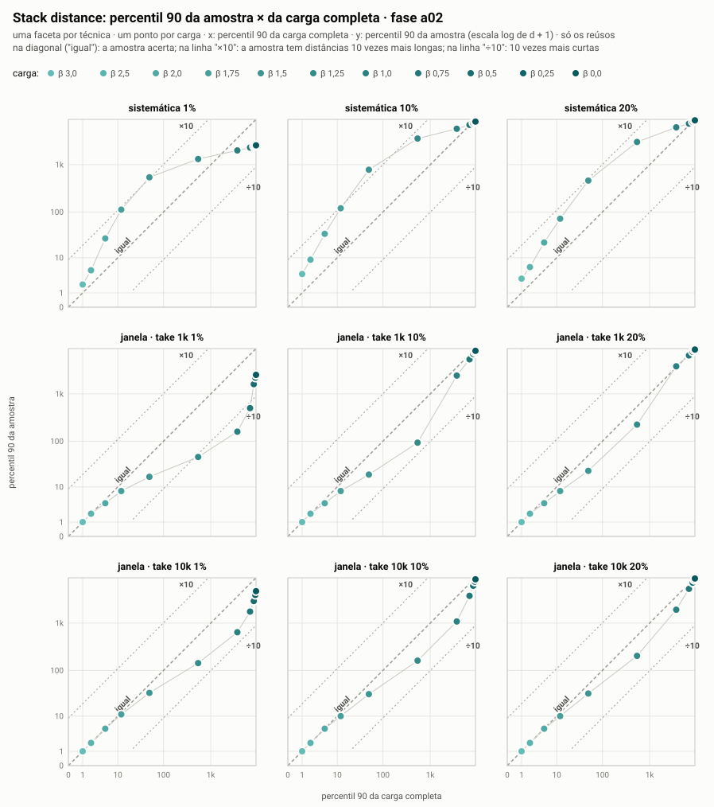
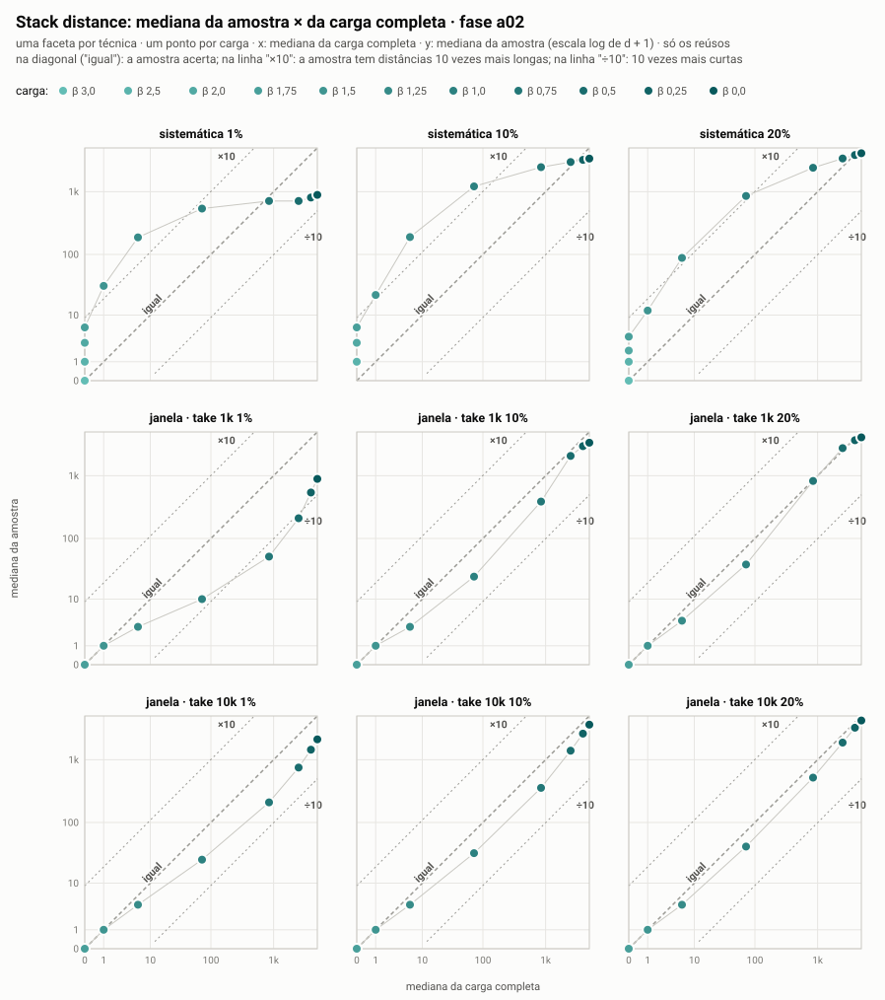
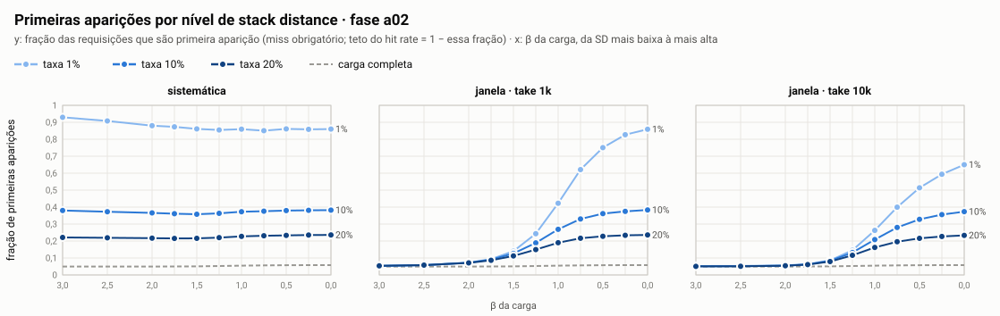

**Assunto:** Comparativo da stack distance: carga completa x amostras

---

Seguem os gráficos que comparam diretamente a stack distance (SD) da carga completa com a das amostras, como o senhor sugeriu.

**1. Relembrando o β**

As cargas são geradas com uma lei de potência controlada pelo parâmetro β. Quanto MAIOR o β, MENOR a stack distance: os reúsos ficam mais próximos. Usei 11 valores, de β = 3,0 (SD muito baixa: 83% dos reúsos são imediatos, mediana 0) até β = 0,0 (SD muito alta: mediana em torno de 5.000). Cada carga tem 1 milhão de requisições, e sobre cada uma apliquei as técnicas de amostragem sistemática e por janelada (take de 1 mil ou 10 mil), com taxas de 1%, 10% e 20%.

Nos exemplos abaixo, uso a taxa de 10%, salvo quando indicado.

**2. Os gráficos**

**Figura 1**
 

**Figura 2**

- Uma grade 3 x 3: uma faceta por técnica de amostragem (linhas: sistemática, janelada com take 1 mil, janelada com take 10 mil; colunas: taxas de 1%, 10% e 20%).
- Em cada faceta, um ponto por carga. A cor vai do turquesa claro (β = 3,0, SD baixa) ao turquesa escuro (β = 0,0, SD alta), e uma linha fina liga os pontos na ordem de β.
- Eixo x: a mediana (ou o p90) da SD na carga completa. Eixo y: a mesma medida na amostra.
- A diagonal "igual" é onde a amostra acerta. As linhas "×10" e "÷10" mostram onde a amostra erraria por um fator de 10, para cima ou para baixo.

**3. Resultados**

**a) SD baixa (β alto): a janelada preserva o Stack Distance, como esperávamos.**

- A janelada, com takes e amostras maiores, conserva a stack distance (como é visto em ambos os gráficos os pontos mais claros próximo e em cima da linha diagonal central). Diferentemente da sistemática, em que os pontos mais claros se distanciam, alongando o stack distance.

- Na Figura 1, do sd_p50, faceta "janela · take 1k, 10%": os pontos claros (β = 2,0 e 1,5) estão em cima da diagonal "igual"; a mediana da amostra é igual à da carga (0 e 1). Na faceta "sistemática, 10%", os mesmos pontos estão acima da diagonal, e o de β = 1,5 chega à linha "×10" (mediana 22 contra 1 na carga).

**b) SD alta (β ≤ 0,5)**

- Na Figura 1, do sd_p50, faceta "sistemática, 10%": os pontos escuros (β = 0,5, 0,25 e 0,0) ficam próximos da diagonal. Na faceta "janela · take 10k, 10%", ficam um pouco abaixo dela.

- Com 1% de amostra, para todas as técnicas e ambos os gráficos, o erro é de diminuir as distâncias de reúso. Nos demais casos, sistemática e janelada preservam bem o stack distance.

**c) Faixa intermediária (β ≈ 1,0): as duas técnicas erram, em sentidos opostos.**

- Geram a barriga nos dois gráficos, com β entre 1,5 e 0,75 há o distanciamento da linha de igualdade, ou seja, são cargas que erram mais no stack distance.

- E para os casos de sistemática, as amostras têm distâncias mais longas que a completa, ou seja, tende a alongar mais o stack distance.

- Já para técnica janelada, o percentis são mais curtos na amostra que na carga completa, tendendo a diminuir o stack distance da carga.

**d) "Sem" localidade (β = 0,0).**

- É o ponto mais escuro nos gráficos. Tende a ter um baixo erro, mas quando erra, tende a aproximar os reúsos.

**e) Primeiras aparições: o efeito que não aparece nos gráficos de SD.**

## O que importa para a curva de Hit Ratio

**Figura 3**

A Figura 3 mostra o efeito direto desses erros na curva de hit ratio. Como o hit rate depende tanto da distância dos reúsos quanto da quantidade de requisições que são primeiras aparições, a amostra pode errar a curva mesmo quando parte dos percentis de SD parece próximo do original.

**Figura 4**

Os gráficos anteriores comparam apenas os percentis da stack distance finita, isto é, os casos em que houve reúso. Eles não mostram diretamente as primeiras aparições de objetos na amostra. Essas primeiras aparições correspondem a SD infinita e são misses obrigatórios para qualquer cache, independentemente do tamanho ou da política.

Por isso, mesmo quando a amostra parece próxima da carga completa em p50 ou p90 de SD, ela ainda pode errar a curva de hit ratio se transformar muitos reúsos da carga original em primeiras aparições dentro da amostra.

A Figura 4 mostra esse efeito. 
- Na carga completa, a fração de primeiras aparições fica praticamente constante, em torno de 5% a 6%, porque esse parâmetro foi controlado na geração. 
- Já na amostragem sistemática, essa fração sobe muito e se mantém alta em todas as cargas. Com 10% de amostragem, por exemplo, a sistemática fica perto de 36% a 38% de primeiras aparições, tanto em cargas de SD baixa quanto em cargas de SD alta. Isso explica as perdas claras e quase constantes de hit rate: a técnica quebra os reúsos próximos e faz muitos objetos parecerem novos na amostra.

- A janelada se comporta de forma diferente. Como ela preserva trechos contínuos do trace, nas cargas de SD baixa ela mantém a fração de primeiras aparições próxima da carga completa, especialmente com take maior. Conforme a stack distance da carga original aumenta, os reúsos ficam mais espalhados no tempo e passam a cair fora das janelas amostradas; nesse caso, a fração de primeiras aparições cresce. Ou seja, ao contrário da sistemática, a janelada mostra um comportamento dependente do nível de stack distance da carga original.

Assim, a leitura final é que existem dois erros diferentes: o erro na distância dos reúsos que sobreviveram na amostra, mostrado nos gráficos de p50 e p90, e o erro na quantidade de reúsos que deixaram de existir na amostra e viraram primeiras aparições, mostrado na Figura 4. A curva de hit ratio é afetada pelos dois:

- Primeiras aparições -> Teto máximo de Hit Ratio
- Distribuição do SD finitos -> Comportamento da curva
